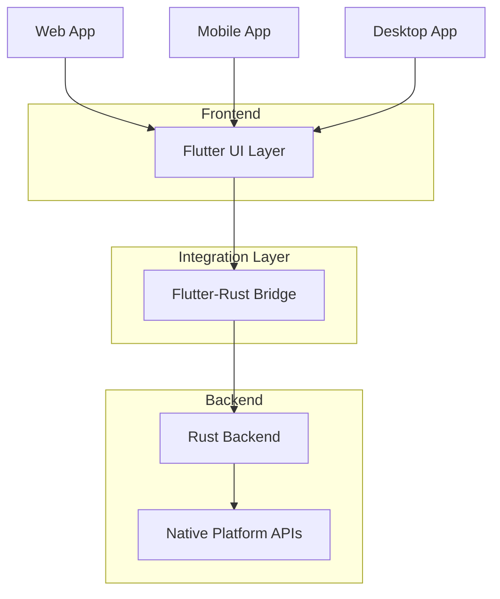

# Flutter UI Ecosystem

## Overview

The Kled.io Ecosystem leverages Flutter as its primary UI framework, providing a consistent user experience across web, mobile, and desktop platforms. This approach enables enterprises to develop and deploy applications that work seamlessly across different devices and platforms, all powered by our Rust backend.

## Architecture



The Flutter UI ecosystem sits at the frontend of the Kled.io platform, providing a consistent user interface across different platforms. This architecture enables a single codebase to target multiple platforms, reducing development effort and ensuring a consistent user experience.

## Key Components

### Flutter Framework

The Flutter framework provides a comprehensive set of UI components and tools for building cross-platform applications. It enables developers to create high-performance, visually attractive applications that work consistently across different platforms.

```dart
import 'package:flutter/material.dart';

void main() {
  runApp(const MyApp());
}

class MyApp extends StatelessWidget {
  const MyApp({Key? key}) : super(key: key);

  @override
  Widget build(BuildContext context) {
    return MaterialApp(
      title: 'Kled.io',
      theme: ThemeData(
        primarySwatch: Colors.blue,
      ),
      home: const MyHomePage(title: 'Kled.io Dashboard'),
    );
  }
}

class MyHomePage extends StatefulWidget {
  const MyHomePage({Key? key, required this.title}) : super(key: key);

  final String title;

  @override
  State<MyHomePage> createState() => _MyHomePageState();
}

class _MyHomePageState extends State<MyHomePage> {
  @override
  Widget build(BuildContext context) {
    return Scaffold(
      appBar: AppBar(
        title: Text(widget.title),
      ),
      body: Center(
        child: Column(
          mainAxisAlignment: MainAxisAlignment.center,
          children: <Widget>[
            const Text(
              'Welcome to Kled.io',
              style: TextStyle(fontSize: 24),
            ),
          ],
        ),
      ),
    );
  }
}
```

### Flutter-Rust Bridge

The Flutter-Rust Bridge enables seamless communication between the Flutter UI and the Rust backend, allowing for efficient data exchange and function calls between the two environments.

```dart
import 'package:flutter/material.dart';
import 'package:flutter_rust_bridge/flutter_rust_bridge.dart';
import 'package:kled_app/bridge_generated.dart';

class RustBridgeExample extends StatefulWidget {
  const RustBridgeExample({Key? key}) : super(key: key);

  @override
  State<RustBridgeExample> createState() => _RustBridgeExampleState();
}

class _RustBridgeExampleState extends State<RustBridgeExample> {
  final api = RustAPI();
  String _greeting = '';

  @override
  void initState() {
    super.initState();
    _loadGreeting();
  }

  Future<void> _loadGreeting() async {
    final greeting = await api.greet(name: 'Flutter');
    setState(() {
      _greeting = greeting;
    });
  }

  @override
  Widget build(BuildContext context) {
    return Scaffold(
      appBar: AppBar(
        title: const Text('Flutter-Rust Bridge Example'),
      ),
      body: Center(
        child: Text(
          _greeting,
          style: const TextStyle(fontSize: 24),
        ),
      ),
    );
  }
}
```

### Tauri Integration

The Tauri integration enables the Flutter UI to work seamlessly with the Tauri framework, providing a native desktop experience while leveraging the cross-platform capabilities of Flutter.

```dart
import 'package:flutter/material.dart';
import 'package:tauri_flutter/tauri_flutter.dart';

class TauriExample extends StatefulWidget {
  const TauriExample({Key? key}) : super(key: key);

  @override
  State<TauriExample> createState() => _TauriExampleState();
}

class _TauriExampleState extends State<TauriExample> {
  final tauri = TauriFlutter();
  String _message = '';

  @override
  void initState() {
    super.initState();
    _loadMessage();
  }

  Future<void> _loadMessage() async {
    final message = await tauri.invoke('get_message', {});
    setState(() {
      _message = message;
    });
  }

  @override
  Widget build(BuildContext context) {
    return Scaffold(
      appBar: AppBar(
        title: const Text('Tauri Integration Example'),
      ),
      body: Center(
        child: Text(
          _message,
          style: const TextStyle(fontSize: 24),
        ),
      ),
    );
  }
}
```

## Benefits

### Cross-Platform Compatibility

The Flutter UI ecosystem enables applications to run consistently across different platforms, providing a seamless user experience regardless of the device or platform:

- **Web**: Flutter applications can be compiled to web standards (HTML, CSS, JavaScript) using the Flutter web renderer, enabling them to run in any modern web browser.
- **Mobile**: Flutter applications can be compiled to native ARM code for iOS and Android, providing native-like performance and access to platform-specific features.
- **Desktop**: Flutter applications can be compiled to native code for Windows, macOS, and Linux, providing a native desktop experience.

### Performance

The Flutter UI ecosystem provides exceptional performance, with smooth animations and responsive interfaces:

- **Dart AOT Compilation**: Flutter applications are compiled to native code using Dart's ahead-of-time (AOT) compiler, providing native-like performance.
- **Skia Graphics Engine**: Flutter uses the Skia graphics engine to render UI components, ensuring smooth animations and consistent rendering across platforms.
- **Efficient Resource Usage**: Flutter's widget system is designed for efficiency, minimizing resource usage and ensuring optimal performance even on low-end devices.

### Developer Productivity

The Flutter UI ecosystem enhances developer productivity, enabling faster development and easier maintenance:

- **Hot Reload**: Flutter's hot reload feature enables developers to see the effects of code changes immediately, without restarting the application.
- **Rich Widget Library**: Flutter provides a comprehensive set of pre-built widgets that can be customized to match the application's design requirements.
- **Strong Tooling**: Flutter comes with a rich set of development tools, including a powerful IDE integration, debugging tools, and performance profiling.

## Implementation Details

### UI Components

The Kled.io UI is built using a set of custom Flutter widgets that provide a consistent look and feel across different parts of the application:

```dart
import 'package:flutter/material.dart';

class KledButton extends StatelessWidget {
  final String text;
  final VoidCallback onPressed;
  final bool primary;

  const KledButton({
    Key? key,
    required this.text,
    required this.onPressed,
    this.primary = true,
  }) : super(key: key);

  @override
  Widget build(BuildContext context) {
    return ElevatedButton(
      onPressed: onPressed,
      style: ElevatedButton.styleFrom(
        primary: primary ? Theme.of(context).primaryColor : Colors.grey[300],
        onPrimary: primary ? Colors.white : Colors.black87,
        padding: const EdgeInsets.symmetric(horizontal: 16, vertical: 12),
        shape: RoundedRectangleBorder(
          borderRadius: BorderRadius.circular(8),
        ),
      ),
      child: Text(
        text,
        style: const TextStyle(
          fontSize: 16,
          fontWeight: FontWeight.bold,
        ),
      ),
    );
  }
}

class KledCard extends StatelessWidget {
  final Widget child;
  final String? title;
  final VoidCallback? onTap;

  const KledCard({
    Key? key,
    required this.child,
    this.title,
    this.onTap,
  }) : super(key: key);

  @override
  Widget build(BuildContext context) {
    return Card(
      elevation: 2,
      shape: RoundedRectangleBorder(
        borderRadius: BorderRadius.circular(12),
      ),
      child: InkWell(
        onTap: onTap,
        borderRadius: BorderRadius.circular(12),
        child: Padding(
          padding: const EdgeInsets.all(16),
          child: Column(
            crossAxisAlignment: CrossAxisAlignment.start,
            children: [
              if (title != null)
                Padding(
                  padding: const EdgeInsets.only(bottom: 12),
                  child: Text(
                    title!,
                    style: const TextStyle(
                      fontSize: 18,
                      fontWeight: FontWeight.bold,
                    ),
                  ),
                ),
              child,
            ],
          ),
        ),
      ),
    );
  }
}
```

### State Management

The Kled.io UI uses a combination of state management approaches to handle different types of state:

```dart
import 'package:flutter/material.dart';
import 'package:provider/provider.dart';

class WorkspaceState extends ChangeNotifier {
  List<Workspace> _workspaces = [];
  Workspace? _selectedWorkspace;

  List<Workspace> get workspaces => _workspaces;
  Workspace? get selectedWorkspace => _selectedWorkspace;

  void setWorkspaces(List<Workspace> workspaces) {
    _workspaces = workspaces;
    notifyListeners();
  }

  void selectWorkspace(Workspace workspace) {
    _selectedWorkspace = workspace;
    notifyListeners();
  }
}

class WorkspaceProvider extends StatelessWidget {
  final Widget child;

  const WorkspaceProvider({
    Key? key,
    required this.child,
  }) : super(key: key);

  @override
  Widget build(BuildContext context) {
    return ChangeNotifierProvider(
      create: (_) => WorkspaceState(),
      child: child,
    );
  }
}

class WorkspaceList extends StatelessWidget {
  const WorkspaceList({Key? key}) : super(key: key);

  @override
  Widget build(BuildContext context) {
    final workspaceState = Provider.of<WorkspaceState>(context);
    final workspaces = workspaceState.workspaces;

    return ListView.builder(
      itemCount: workspaces.length,
      itemBuilder: (context, index) {
        final workspace = workspaces[index];
        return ListTile(
          title: Text(workspace.name),
          subtitle: Text(workspace.description),
          onTap: () {
            workspaceState.selectWorkspace(workspace);
          },
        );
      },
    );
  }
}
```

### Platform Integration

The Kled.io UI integrates with platform-specific features through a set of platform channels and plugins:

```dart
import 'package:flutter/material.dart';
import 'package:flutter/services.dart';

class PlatformIntegration {
  static const MethodChannel _channel = MethodChannel('kled.io/platform');

  static Future<String> getPlatformVersion() async {
    try {
      final String version = await _channel.invokeMethod('getPlatformVersion');
      return version;
    } on PlatformException catch (e) {
      return 'Failed to get platform version: ${e.message}';
    }
  }

  static Future<bool> openFile(String path) async {
    try {
      final bool result = await _channel.invokeMethod('openFile', {'path': path});
      return result;
    } on PlatformException catch (e) {
      return false;
    }
  }

  static Future<String?> saveFile(String content, String fileName) async {
    try {
      final String? path = await _channel.invokeMethod('saveFile', {
        'content': content,
        'fileName': fileName,
      });
      return path;
    } on PlatformException catch (e) {
      return null;
    }
  }
}
```

## Conclusion

The Flutter UI ecosystem is a key component of the Kled.io platform, providing a consistent user experience across web, mobile, and desktop platforms. By leveraging Flutter's cross-platform capabilities and integrating with our Rust backend through the Flutter-Rust Bridge, we enable enterprises to develop and deploy applications that work seamlessly across different devices and platforms, all while maintaining the performance and security benefits of Rust.
