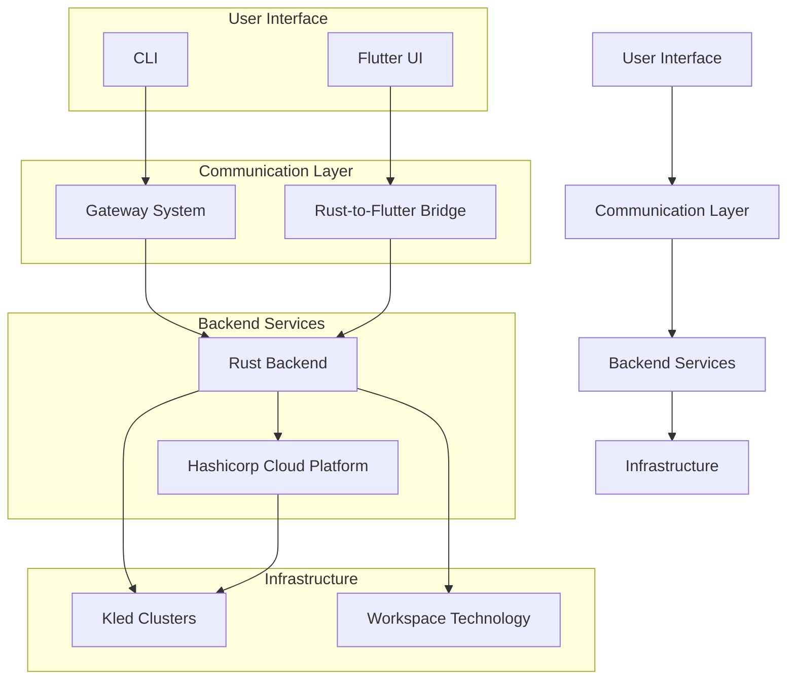

# Architecture

The Kled.io Ecosystem is built on a robust and scalable architecture that enables enterprises to deploy and manage AI/ML workloads with unprecedented efficiency, security, and scalability. This section provides an overview of the key architectural components of the Kled.io Ecosystem.

## Architecture Overview

The Kled.io Ecosystem architecture is designed to provide a seamless experience for users, from the command-line interface to the Kled Cluster infrastructure. The architecture is built on several key components, each with its own responsibilities and features.

## Key Components

### [Pure Rust Communication](./pure-rust-communication.md)

The Pure Rust Communication layer provides a high-performance, secure, and reliable communication infrastructure for the Kled.io Ecosystem. Built entirely in Rust, this layer enables efficient data exchange between different components of the system, ensuring optimal performance and security.

Key features:
- High-performance communication using Rust's zero-cost abstractions
- Strong type safety and memory safety guarantees
- Efficient serialization and deserialization of data
- Comprehensive error handling and recovery mechanisms

[Learn more about Pure Rust Communication](./pure-rust-communication.md)

### [Kled Cluster](./kled-cluster.md)

Kled Clusters are fully operable Kubernetes clusters running inside Physical Clusters, providing a secure and efficient environment for running AI/ML workloads. This architecture enables enterprises to maximize the value of their infrastructure investments while ensuring the security and performance of their AI/ML applications.

Key features:
- Resource efficiency through shared infrastructure
- Strong isolation between workloads
- Seamless scaling for changing requirements
- Advanced user management and administration
- Support for both external and internal clustering

[Learn more about Kled Cluster](./kled-cluster.md)

### [Flutter UI](./flutter-ui.md)

The Flutter UI provides a cross-platform user interface for the Kled.io Ecosystem, enabling users to manage their workspaces, Kled Clusters, and AI/ML workloads from any device. Built with Flutter, the UI offers a consistent and intuitive experience across web, mobile, and desktop platforms.

Key features:
- Cross-platform support for web, mobile, and desktop
- Consistent and intuitive user experience
- High-performance rendering and animations
- Comprehensive set of UI components and widgets

[Learn more about Flutter UI](./flutter-ui.md)

## [Advanced Workspace Technology](./workspace-technology.md)

The Kled.io Ecosystem features an advanced workspace technology that provides a comprehensive environment for development and deployment. This technology is built on DevPod and Daytona, with a proprietary preload for loading Kled into workspaces, creating a powerful and flexible development environment.

Key features:
- Proprietary workspace creation to copy repo's and open in IDE
- Proprietary preload with full language support and Docker/Kubernetes tools
- Multiple workspace providers (local, Kubernetes, cloud)
- Monorepo support with project discovery and dependency management
- Linux-like environment with comprehensive development tools

[Learn more about the Advanced Workspace Technology](./workspace-technology.md)

## Hashicorp Cloud Platform Integration

The Kled.io Ecosystem includes comprehensive integration with the Hashicorp Cloud Platform (HCP), providing a robust foundation for infrastructure management, security, and automation:

### Terraform Integration

The Kled.io Ecosystem integrates with Terraform for infrastructure as code, enabling users to define and provision infrastructure using a declarative configuration language. This integration enables enterprises to manage their infrastructure in a consistent and repeatable way, ensuring that all environments are configured correctly.

### Vault Integration

The Kled.io Ecosystem integrates with Vault for secrets management, providing a secure way to store and access sensitive information. This integration enables enterprises to manage secrets across their entire infrastructure, ensuring that sensitive information is protected and accessible only to authorized users.

### Consul Integration

The Kled.io Ecosystem integrates with Consul for service discovery and configuration management, enabling services to discover and connect with each other. This integration enables enterprises to build dynamic and resilient applications that can adapt to changing environments.

### Additional Hashicorp Integrations

The Kled.io Ecosystem also integrates with other Hashicorp products:

- **Waypoint**: For application deployment and lifecycle management.
- **Packer**: For building machine images for multiple platforms.
- **Vagrant**: For development environment management.
- **Vault Radar**: For secrets detection and management.
- **Vault Secrets**: For secrets management and rotation.
- **Vault Dedicated**: For dedicated Vault instances.

## Architecture Benefits

The Kled.io Ecosystem architecture provides several key benefits for enterprises:

### Performance

The Kled.io Ecosystem architecture is designed for high performance, enabling enterprises to run AI/ML workloads efficiently:

- **Pure Rust Communication**: The Pure Rust Communication layer provides high-performance communication between different components of the system.
- **Kled Clusters**: Kled Clusters enable efficient resource utilization by allowing multiple clusters to share the same underlying infrastructure.
- **Flutter UI**: The Flutter UI provides a high-performance user interface that is responsive and intuitive.

### Security

The Kled.io Ecosystem architecture includes comprehensive security features, ensuring that enterprises can deploy and manage AI/ML workloads securely:

- **Pure Rust Communication**: The Pure Rust Communication layer provides strong type safety and memory safety guarantees, preventing common security vulnerabilities.
- **Kled Clusters**: Kled Clusters provide strong isolation between different workloads, ensuring that each application has its own secure environment.
- **Hashicorp Cloud Platform**: The Hashicorp Cloud Platform integration provides comprehensive security features, including secrets management, identity management, and policy enforcement.

### Scalability

The Kled.io Ecosystem architecture is designed for scalability, enabling enterprises to adapt to changing requirements:

- **Kled Clusters**: Kled Clusters enable seamless scaling of AI/ML workloads, allowing enterprises to adapt to changing requirements.
- **Workspace Technology**: The Workspace Technology supports monorepos and project discovery, enabling enterprises to manage complex projects efficiently.
- **Hashicorp Cloud Platform**: The Hashicorp Cloud Platform integration provides infrastructure as code, enabling enterprises to provision and manage infrastructure at scale.

## Conclusion

The Kled.io Ecosystem architecture provides a robust and scalable foundation for deploying and managing AI/ML workloads. By leveraging the strengths of each component, the Kled.io Ecosystem enables enterprises to develop, deploy, and manage AI/ML applications with unprecedented efficiency, security, and scalability.
