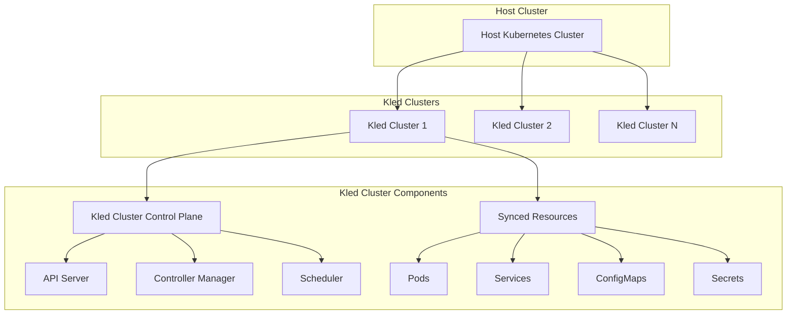

# Kled Cluster

Kled Cluster is a revolutionary technology that creates fully functional virtual Kubernetes clusters that run inside regular namespaces of a host Kubernetes cluster. Unlike regular namespaces, Kled Clusters are fully isolated environments with their own control plane, allowing teams to use them just like regular clusters while leveraging the underlying host cluster for efficiency.

## Overview



Kled Clusters provide a powerful solution for multi-tenancy in Kubernetes, enabling teams to work in isolated environments while efficiently sharing the underlying infrastructure. This architecture allows enterprises to maximize resource utilization while maintaining strong isolation between different teams and workloads.

## Key Features

### Isolated Control Plane

Each Kled Cluster has its own isolated control plane, providing a dedicated environment for managing Kubernetes resources:

- **API Server**: Each Kled Cluster has its own API server, allowing users to interact with the cluster using standard Kubernetes tools.
- **Controller Manager**: The controller manager ensures that the desired state of resources is maintained within the Kled Cluster.
- **Scheduler**: The scheduler places pods on available nodes within the Kled Cluster, optimizing resource utilization.

This isolated control plane provides several key benefits:

- **Administrative Isolation**: Users can have admin access to their Kled Cluster without having admin access to the host cluster.
- **API Isolation**: API requests are processed by the Kled Cluster's API server, preventing unauthorized access to the host cluster.
- **Resource Isolation**: Resources created in a Kled Cluster are isolated from other Kled Clusters, preventing conflicts and ensuring security.

### Resource Synchronization

Kled Clusters synchronize resources between the virtual cluster and the host cluster, ensuring that resources created in the Kled Cluster are properly represented in the host cluster:

```yaml
# Example synchronization configuration
sync:
  # Resources to synchronize
  resources:
    # Pods
    - name: pods
      # Synchronization mode
      mode: bidirectional
      # Namespace mapping
      namespaceMapping:
        # Map virtual cluster namespaces to host cluster namespaces
        default: kled-cluster-1-default
        kube-system: kled-cluster-1-kube-system

    # Services
    - name: services
      mode: bidirectional
      namespaceMapping:
        default: kled-cluster-1-default
        kube-system: kled-cluster-1-kube-system

    # ConfigMaps
    - name: configmaps
      mode: bidirectional
      namespaceMapping:
        default: kled-cluster-1-default
        kube-system: kled-cluster-1-kube-system

    # Secrets
    - name: secrets
      mode: bidirectional
      namespaceMapping:
        default: kled-cluster-1-default
        kube-system: kled-cluster-1-kube-system
```

This synchronization provides several key benefits:

- **Transparent Resource Management**: Resources created in the Kled Cluster are automatically synchronized to the host cluster, ensuring that they are properly managed.
- **Efficient Resource Utilization**: Resources are shared between Kled Clusters, maximizing resource utilization and reducing overhead.
- **Simplified Management**: Administrators can manage resources at the host cluster level while still providing isolated environments for users.

### Multi-Tenancy

Kled Clusters provide a powerful solution for multi-tenancy in Kubernetes, enabling multiple teams to share a single host cluster while maintaining isolation:

```yaml
# Example multi-tenancy configuration
apiVersion: kled.io/v1
kind: KledCluster
metadata:
  name: team-a
spec:
  # Namespace for the Kled Cluster
  namespace: team-a

  # Resource limits
  resources:
    limits:
      cpu: "4"
      memory: "8Gi"
    requests:
      cpu: "2"
      memory: "4Gi"

  # Network configuration
  networking:
    # Network plugin
    plugin: cilium
    # Pod CIDR
    podCIDR: 10.42.0.0/16
    # Service CIDR
    serviceCIDR: 10.43.0.0/16

  # Storage configuration
  storage:
    # Storage class
    storageClass: standard
    # Storage capacity
    capacity: 100Gi
```

This multi-tenancy provides several key benefits:

- **Team Isolation**: Each team can have its own Kled Cluster, providing a dedicated environment for development and deployment.
- **Resource Quotas**: Administrators can set resource quotas for each Kled Cluster, ensuring fair resource allocation.
- **Policy Enforcement**: Policies can be enforced at the Kled Cluster level, ensuring compliance with security and operational requirements.
- **Cost Allocation**: Resource usage can be tracked at the Kled Cluster level, enabling accurate cost allocation.

### Kubernetes Compatibility

Kled Clusters are fully compatible with standard Kubernetes, enabling users to use the same tools and workflows they are familiar with:

- **kubectl**: Users can interact with Kled Clusters using kubectl, the standard Kubernetes command-line tool.
- **Helm**: Helm charts can be deployed to Kled Clusters, enabling easy application deployment.
- **Kubernetes APIs**: Kled Clusters support the standard Kubernetes APIs, ensuring compatibility with existing tools and workflows.
- **Custom Resources**: Custom Resource Definitions (CRDs) can be used in Kled Clusters, enabling advanced use cases.

This compatibility provides several key benefits:

- **Familiar Workflows**: Users can continue to use the tools and workflows they are familiar with, reducing the learning curve.
- **Ecosystem Integration**: Kled Clusters integrate with the broader Kubernetes ecosystem, enabling the use of a wide range of tools and services.
- **Future-Proof**: As Kubernetes evolves, Kled Clusters will continue to support the latest features and capabilities.

### Advanced Networking

Kled Clusters provide advanced networking capabilities, enabling secure and efficient communication between pods and services:

```yaml
# Example networking configuration
networking:
  # Network plugin
  plugin: cilium
  # Pod CIDR
  podCIDR: 10.42.0.0/16
  # Service CIDR
  serviceCIDR: 10.43.0.0/16
  # DNS configuration
  dns:
    # DNS service
    service: coredns
    # DNS domain
    domain: cluster.local
  # Ingress configuration
  ingress:
    # Ingress controller
    controller: nginx
    # Ingress class
    class: nginx
  # Network policies
  networkPolicies:
    # Enable network policies
    enabled: true
    # Default deny all
    defaultDeny: true
```

This advanced networking provides several key benefits:

- **Network Isolation**: Kled Clusters have their own network namespace, providing isolation from other clusters.
- **Service Discovery**: Services in Kled Clusters can be discovered using standard Kubernetes service discovery mechanisms.
- **Network Policies**: Network policies can be applied at the Kled Cluster level, enabling fine-grained control over network traffic.
- **Ingress Control**: Ingress controllers can be deployed to Kled Clusters, enabling external access to services.

### Persistent Storage

Kled Clusters support persistent storage, enabling stateful applications to run reliably:

```yaml
# Example storage configuration
storage:
  # Storage class
  storageClass: standard
  # Storage capacity
  capacity: 100Gi
  # Volume binding mode
  volumeBindingMode: Immediate
  # Reclaim policy
  reclaimPolicy: Delete
  # Allow volume expansion
  allowVolumeExpansion: true
  # Mount options
  mountOptions:
    - discard
    - noatime
```

This persistent storage provides several key benefits:

- **Stateful Applications**: Stateful applications can run reliably in Kled Clusters, with persistent storage for data.
- **Data Persistence**: Data persists across pod restarts and rescheduling, ensuring reliability.
- **Storage Classes**: Different storage classes can be used for different types of applications, optimizing performance and cost.
- **Volume Snapshots**: Volume snapshots can be used for backup and recovery, ensuring data safety.

## Integration with Kled Ecosystem

Kled Clusters integrate seamlessly with the broader Kled Ecosystem, providing a comprehensive solution for Kubernetes management:

### Kled CLI

The Kled CLI provides a simple and intuitive way to manage Kled Clusters:

```bash
# Create a Kled Cluster
kled cluster create my-cluster --namespace my-namespace

# Get Kled Clusters
kled cluster get

# Connect to a Kled Cluster
kled cluster connect my-cluster

# Delete a Kled Cluster
kled cluster delete my-cluster
```

This integration provides several key benefits:

- **Simplified Management**: The Kled CLI simplifies the management of Kled Clusters, reducing complexity.
- **Consistent Experience**: The Kled CLI provides a consistent experience across different environments, from development to production.
- **Automation**: The Kled CLI can be used in scripts and CI/CD pipelines, enabling automation of cluster management.

### Kledspace

Kledspace provides a powerful development environment for Kubernetes, enabling developers to build, test, and debug applications directly in Kled Clusters:

```yaml
# Example Kledspace configuration
version: v1
name: my-app

# Development container configuration
dev:
  # Container image
  image: kled/dev:latest

  # Port forwarding
  ports:
    - 8080:8080
    - 9229:9229

  # File synchronization
  sync:
    - src: ./src
      dest: /app/src
    - src: ./package.json
      dest: /app/package.json

  # Commands
  commands:
    - name: dev
      command: npm run dev
    - name: test
      command: npm test
    - name: build
      command: npm run build
```

This integration provides several key benefits:

- **Development in Production-Like Environment**: Developers can work in an environment that closely resembles production, reducing the "works on my machine" problem.
- **Isolated Development**: Each developer can have their own isolated environment, preventing conflicts.
- **Efficient Resource Utilization**: Development environments can share the same underlying infrastructure, maximizing resource utilization.

### kPolicy

kPolicy provides a policy management system for Kubernetes, enabling administrators to define and enforce policies across Kled Clusters:

```yaml
# Example kPolicy configuration
apiVersion: policy.kled.io/v1
kind: Policy
metadata:
  name: resource-limits
spec:
  # Policy rules
  rules:
    - name: container-limits
      match:
        kinds:
          - Pod
      validate:
        message: "Container must have resource limits"
        pattern:
          spec:
            containers:
              - resources:
                  limits:
                    memory: "?*"
                    cpu: "?*"
```

This integration provides several key benefits:

- **Consistent Policy Enforcement**: Policies can be enforced consistently across Kled Clusters, ensuring compliance with security and operational requirements.
- **Centralized Policy Management**: Policies can be managed centrally and applied to multiple Kled Clusters, simplifying administration.
- **Policy Inheritance**: Kled Clusters can inherit policies from parent clusters, ensuring consistent policy enforcement.

## Use Cases

### Development Environments

Kled Clusters provide isolated development environments for teams, enabling them to work independently without interfering with each other:

```bash
# Create a development Kled Cluster
kled cluster create dev-cluster --namespace dev

# Create a workspace for a project
kled workspace create project-a --repo https://github.com/org/project-a --cluster dev-cluster

# Deploy supporting services
kled service deploy redis --cluster dev-cluster
kled service deploy postgres --cluster dev-cluster
```

This use case provides several key benefits:

- **Isolated Development**: Each team can have its own isolated environment, preventing conflicts.
- **Production-Like Environment**: Development environments can closely resemble production, reducing the "works on my machine" problem.
- **Resource Efficiency**: Multiple development environments can share the same underlying infrastructure, maximizing resource utilization.

### Testing Environments

Kled Clusters provide isolated testing environments for validating applications before deployment to production:

```bash
# Create a testing Kled Cluster
kled cluster create test-cluster --namespace test

# Deploy the application for testing
kled app deploy --repo https://github.com/org/app --cluster test-cluster

# Run tests
kled app test --cluster test-cluster
```

This use case provides several key benefits:

- **Isolated Testing**: Each application can be tested in an isolated environment, preventing interference from other applications.
- **Production-Like Testing**: Testing environments can closely resemble production, ensuring accurate testing.
- **Parallel Testing**: Multiple tests can run in parallel in different Kled Clusters, accelerating the testing process.

### Multi-Tenant Production

Kled Clusters provide a secure and efficient solution for multi-tenant production environments:

```bash
# Create a production Kled Cluster for a tenant
kled cluster create tenant-a --namespace tenant-a-prod

# Deploy the application for the tenant
kled app deploy --repo https://github.com/org/tenant-a-app --cluster tenant-a

# Scale the application
kled app scale tenant-a-app --replicas 3 --cluster tenant-a
```

This use case provides several key benefits:

- **Tenant Isolation**: Each tenant can have its own isolated environment, ensuring security and preventing interference.
- **Resource Efficiency**: Multiple tenants can share the same underlying infrastructure, maximizing resource utilization.
- **Simplified Management**: Administrators can manage all tenants from a single host cluster, simplifying operations.

## Advanced Features

### Cluster Templates

Kled Clusters support templates, enabling administrators to define standardized cluster configurations:

```yaml
# Example cluster template
apiVersion: kled.io/v1
kind: KledClusterTemplate
metadata:
  name: standard-cluster
spec:
  # Base configuration
  base:
    # Kubernetes version
    kubernetesVersion: 1.25.0
    # Control plane configuration
    controlPlane:
      replicas: 1
      resources:
        limits:
          cpu: "1"
          memory: "2Gi"
        requests:
          cpu: "0.5"
          memory: "1Gi"

  # Networking configuration
  networking:
    plugin: cilium
    podCIDR: 10.42.0.0/16
    serviceCIDR: 10.43.0.0/16

  # Storage configuration
  storage:
    storageClass: standard
    capacity: 100Gi

  # Add-ons
  addons:
    # Metrics server
    metricsServer:
      enabled: true
    # Dashboard
    dashboard:
      enabled: true
    # Prometheus
    prometheus:
      enabled: true
    # Grafana
    grafana:
      enabled: true
```

This feature provides several key benefits:

- **Standardized Configurations**: Administrators can define standardized configurations for different types of clusters, ensuring consistency.
- **Simplified Provisioning**: Users can create clusters from templates, simplifying the provisioning process.
- **Governance**: Templates can enforce organizational standards and best practices, ensuring compliance.

### Cluster Federation

Kled Clusters support federation, enabling resources to be shared and managed across multiple clusters:

```yaml
# Example federation configuration
apiVersion: kled.io/v1
kind: KledClusterFederation
metadata:
  name: global-federation
spec:
  # Member clusters
  members:
    - name: cluster-1
      context: cluster-1
    - name: cluster-2
      context: cluster-2
    - name: cluster-3
      context: cluster-3

  # Federated resources
  resources:
    # Federated namespaces
    - kind: Namespace
      propagation:
        type: all
    # Federated services
    - kind: Service
      propagation:
        type: all
    # Federated deployments
    - kind: Deployment
      propagation:
        type: all
```

This feature provides several key benefits:

- **Resource Sharing**: Resources can be shared across multiple clusters, enabling global applications.
- **Centralized Management**: Resources can be managed centrally and propagated to member clusters, simplifying administration.
- **High Availability**: Applications can be deployed across multiple clusters, ensuring high availability.

### Cluster Upgrades

Kled Clusters support in-place upgrades, enabling administrators to upgrade clusters without disrupting applications:

```yaml
# Example upgrade configuration
apiVersion: kled.io/v1
kind: KledClusterUpgrade
metadata:
  name: upgrade-to-1.25
spec:
  # Target cluster
  cluster: my-cluster
  # Target version
  targetVersion: 1.25.0
  # Upgrade strategy
  strategy:
    # Rolling upgrade
    type: rolling
    # Max unavailable
    maxUnavailable: 1
    # Max surge
    maxSurge: 1
  # Pre-upgrade hooks
  preUpgradeHooks:
    - name: backup
      image: kled/backup:latest
      command: ["backup", "--cluster", "my-cluster"]
  # Post-upgrade hooks
  postUpgradeHooks:
    - name: verify
      image: kled/verify:latest
      command: ["verify", "--cluster", "my-cluster"]
```

This feature provides several key benefits:

- **Seamless Upgrades**: Clusters can be upgraded without disrupting applications, ensuring continuous operation.
- **Controlled Rollout**: Upgrades can be rolled out in a controlled manner, minimizing risk.
- **Automated Verification**: Pre and post-upgrade hooks can automate verification, ensuring successful upgrades.

## Benefits

### Resource Efficiency

Kled Clusters enable efficient resource utilization by allowing multiple clusters to share the same underlying infrastructure:

- **Shared Worker Nodes**: Kled Clusters share the same worker nodes, eliminating the need for dedicated nodes for each cluster.
- **Optimized Resource Allocation**: Resources can be allocated dynamically based on workload requirements, ensuring optimal utilization.
- **Reduced Management Overhead**: A single host cluster can manage multiple Kled Clusters, reducing operational complexity and cost.

### Enhanced Security

Kled Clusters provide strong isolation between different workloads, enhancing security:

- **Control Plane Isolation**: Each Kled Cluster has its own control plane, preventing unauthorized access to other clusters.
- **Network Isolation**: Kled Clusters have their own network namespace, preventing unauthorized network access.
- **Resource Isolation**: Resources in one Kled Cluster are isolated from other clusters, preventing interference.
- **Policy Enforcement**: Policies can be enforced at the Kled Cluster level, ensuring compliance with security requirements.

### Simplified Management

Kled Clusters simplify the management of multiple Kubernetes environments:

- **Centralized Administration**: All Kled Clusters can be managed from a single host cluster, simplifying administration.
- **Standardized Configurations**: Cluster templates ensure standardized configurations across all clusters.
- **Automated Operations**: Cluster operations can be automated using the Kled CLI and API, reducing manual effort.
- **Unified Monitoring**: All Kled Clusters can be monitored from a single dashboard, providing comprehensive visibility.

## Conclusion

Kled Clusters provide a powerful solution for multi-tenancy in Kubernetes, enabling teams to work in isolated environments while efficiently sharing the underlying infrastructure. By providing isolated control planes, resource synchronization, and advanced features like templates and federation, Kled Clusters enable enterprises to maximize resource utilization while maintaining strong isolation between different teams and workloads.
