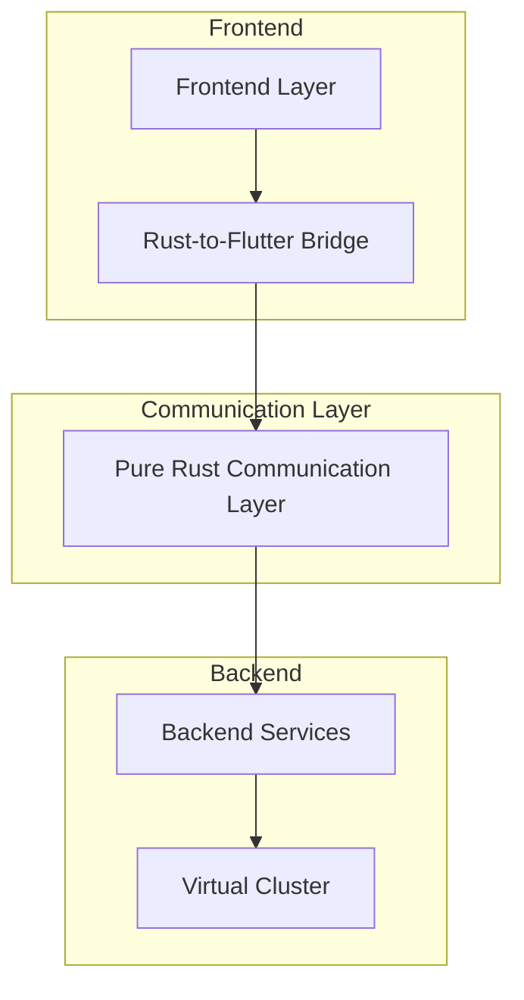

# Pure Rust Communication Layer

## Overview

The Kled.io Ecosystem is built on a pure Rust-to-Rust communication layer, which forms the foundation of our platform's performance, security, and reliability. This approach eliminates JavaScript runtime dependencies and provides a more efficient and secure communication mechanism between components.

## Architecture



The pure Rust communication layer sits at the heart of the Kled.io Ecosystem, connecting the frontend and backend components through a highly efficient and secure channel. This architecture enables seamless communication between different parts of the system while maintaining optimal performance and security.

## Key Components

### Tower UDS (Unix Domain Socket)

The Tower UDS component provides a high-performance communication channel between different parts of the system using Unix Domain Sockets. This approach offers several advantages over traditional network sockets:

- **Higher Performance**: Unix Domain Sockets provide lower latency and higher throughput compared to network sockets, as they avoid the overhead of network protocol stacks.
- **Enhanced Security**: Communication is restricted to the local system, reducing the attack surface and eliminating network-based vulnerabilities.
- **Simplified Authentication**: The operating system's file permission mechanisms can be used to control access to the socket, providing a simple and effective authentication mechanism.

```rust
use tower_uds::UnixDomainSocket;

// Create a Unix Domain Socket
let uds = UnixDomainSocket::new("/path/to/socket");

// Bind the socket
let listener = uds.bind().await?;

// Accept connections
let uds_server = UnixDomainSocket::accept_loop(listener);
```

### Aclix Web Servers

The Aclix Web Servers provide a high-performance HTTP interface for communication between different components of the system. This approach enables seamless integration with web-based clients while maintaining the performance and security benefits of Rust.

```rust
// Create a router
let app = Router::new()
    .route("/", get(|| async { "Kled.io Gateway" }))
    .route("/health", get(|| async { "OK" }));

// Start the HTTP server
let http_addr = "127.0.0.1:3000".parse()?;
let http_server = axum::Server::bind(&http_addr)
    .serve(app.clone().into_make_service());
```

### Rust-to-Flutter Bridge

The Rust-to-Flutter Bridge enables seamless communication between the Rust backend and Flutter frontend, allowing for efficient data exchange and function calls between the two environments.

```rust
#[flutter_rust_bridge::frb(sync)]
pub fn greet(name: String) -> String {
    format!("Hello, {name}!")
}

#[flutter_rust_bridge::frb(init)]
pub fn init_app() {
    // Default utilities - feel free to customize
    flutter_rust_bridge::setup_default_user_utils();
}
```

## Benefits

### Performance

The pure Rust communication layer provides exceptional performance, with low latency and high throughput. This is achieved through several mechanisms:

- **Zero-Copy Data Transfer**: The communication layer minimizes data copying, reducing CPU and memory overhead.
- **Efficient Memory Management**: Rust's ownership model ensures efficient memory usage without the overhead of garbage collection.
- **Optimized Protocol**: The communication protocol is designed for efficiency, minimizing overhead and maximizing throughput.

### Security

Security is a fundamental aspect of the Kled.io Ecosystem, and the pure Rust communication layer plays a critical role in ensuring the security of the platform:

- **Memory Safety**: Rust's ownership model prevents common security vulnerabilities such as buffer overflows and use-after-free errors.
- **Type Safety**: The strong type system catches many potential errors at compile time, reducing the risk of runtime errors and security vulnerabilities.
- **Controlled Access**: The communication layer enforces strict access controls, ensuring that only authorized components can communicate with each other.

### Reliability

The pure Rust communication layer is designed for reliability, ensuring that the system can operate continuously without interruption:

- **Error Handling**: Comprehensive error handling ensures that the system can recover from failures gracefully.
- **Resource Management**: Efficient resource management prevents resource exhaustion and ensures stable operation under load.
- **Concurrency Control**: The communication layer manages concurrency effectively, preventing race conditions and deadlocks.

## Implementation Details

### Gateway System

The Gateway System is a key component of the pure Rust communication layer, providing a centralized point for managing communication between different parts of the system:

```rust
pub struct Gateway {
    /// Gateway configuration
    config: GatewayConfig,
}

impl Gateway {
    /// Create a new gateway server
    pub fn new(config: GatewayConfig) -> Self {
        Self { config }
    }

    /// Initialize the gateway
    pub async fn init(&self) -> Result<()> {
        // Initialize observability
        init_observability(self.config.observability.clone())
            .context("Failed to initialize observability")?;

        info!("Initializing Kled.io gateway");

        Ok(())
    }

    /// Run the gateway server
    pub async fn run(&self) -> Result<()> {
        // Create the router
        let app = Router::new()
            .route("/", get(|| async { "Kled.io Gateway" }))
            .route("/health", get(|| async { "OK" }));

        // Start the HTTP server
        let http_addr = self.config.http_addr;
        info!("Starting HTTP server on {}", http_addr);

        let http_server = axum::Server::bind(&http_addr)
            .serve(app.clone().into_make_service());

        // Start the Unix domain socket server if configured
        let uds_server = if let Some(uds_path) = &self.config.uds_path {
            info!("Starting Unix domain socket server on {}", uds_path);

            let uds = UnixDomainSocket::new(uds_path);
            let listener = uds.bind().await
                .context("Failed to bind Unix domain socket")?;

            let uds_server = UnixDomainSocket::accept_loop(listener);
            Some(uds_server)
        } else {
            None
        };

        // Run the servers
        if let Some(uds_server) = uds_server {
            tokio::select! {
                result = http_server => {
                    result.context("HTTP server error")?;
                }
                _ = uds_server => {
                    error!("Unix domain socket server exited unexpectedly");
                }
            }
        } else {
            http_server.await.context("HTTP server error")?;
        }

        Ok(())
    }
}
```

### CLI Bridge

The CLI Bridge enables seamless integration between the Rust backend and the Go-based CLI, allowing for efficient command execution and data exchange:

```rust
pub struct CliBridge {
    /// CLI configuration
    config: CliConfig,
}

impl CliBridge {
    /// Create a new CLI bridge
    pub fn new(config: CliConfig) -> Self {
        Self { config }
    }

    /// Initialize the CLI bridge
    pub async fn init(&self) -> Result<()> {
        // Initialize observability
        init_observability(self.config.observability.clone())
            .context("Failed to initialize observability")?;

        info!("Initializing Kled.io CLI bridge");

        Ok(())
    }

    /// Run the CLI bridge
    pub async fn run(&self) -> Result<()> {
        // Create the router
        let app = Router::new()
            .route("/", get(|| async { "Kled.io CLI Bridge" }))
            .route("/health", get(|| async { "OK" }));

        // Start the HTTP server
        let http_addr = self.config.http_addr;
        info!("Starting HTTP server on {}", http_addr);

        let http_server = axum::Server::bind(&http_addr)
            .serve(app.clone().into_make_service());

        http_server.await.context("HTTP server error")?;

        Ok(())
    }
}
```

## Conclusion

The pure Rust communication layer is a fundamental component of the Kled.io Ecosystem, providing the foundation for the platform's performance, security, and reliability. By eliminating JavaScript runtime dependencies and leveraging Rust's strengths, the communication layer enables efficient and secure communication between different parts of the system, ensuring optimal performance and security for AI/ML workloads.
