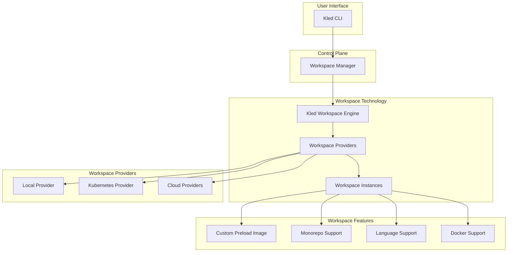

# Workspace Technology

The Kled.io Ecosystem features an advanced workspace technology that provides a comprehensive environment for development and deployment. This proprietary technology creates a powerful and flexible development environment with a specialized preload system for loading Kled into workspaces.

## Architecture Overview



The Kled.io Workspace Technology is designed to provide a seamless development experience across different environments, from local development to cloud-based deployments. The Kled.io Ecosystem offers a powerful and flexible workspace solution that supports a wide range of development workflows.

## Key Components

### Kled Workspace Engine

The Kled Workspace Engine is a proprietary technology that provides a powerful and flexible workspace solution with a consistent and reliable development experience across different environments.

Key features:
- **Provider Agnostic**: The Kled Workspace Engine supports multiple providers, including local, Kubernetes, and cloud providers, enabling developers to create workspaces in different environments.
- **Workspace Templates**: The engine provides a wide range of workspace templates for different languages and frameworks, enabling developers to quickly set up development environments.
- **Workspace Sharing**: The Kled Workspace Engine enables developers to share workspaces with team members, ensuring that everyone has the same development environment.
- **Workspace Customization**: The engine allows developers to customize workspaces with specific tools and configurations, ensuring that the development environment meets their needs.
- **Enhanced Workspace Management**: The Kled Workspace Engine provides advanced workspace management capabilities, enabling developers to create, manage, and share workspaces with ease.
- **Optimized Performance**: The engine optimizes workspace performance, ensuring that developers can work efficiently and effectively.
- **Advanced Security**: The Kled Workspace Engine includes comprehensive security features, ensuring that workspaces are secure and protected.
- **Team Collaboration**: The engine enables team collaboration, allowing developers to work together on projects and share resources.

### Proprietary Preload

The Kled.io Ecosystem includes a proprietary preload for loading Kled into workspaces, providing a comprehensive development environment with support for multiple languages, Docker, and Kubernetes.

Key features:
- **Full Language Support**: The preload includes support for multiple languages, including Python, Node.js, Go, Rust, Java, and more, enabling developers to work with their preferred languages and tools.
- **Docker Support**: The preload includes Docker support, enabling developers to create and manage containers within their workspaces.
- **Kubernetes Support**: The preload includes Kubernetes tools, enabling developers to interact with Kubernetes clusters and deploy applications.
- **Monorepo Support**: The preload includes support for monorepos, enabling developers to manage multiple projects within a single repository.

### Workspace Providers

The Kled.io Ecosystem supports multiple workspace providers, enabling developers to create workspaces in different environments:

#### Local Provider

The Local Provider enables developers to create workspaces on their local machine, providing a simple and efficient way to develop and test applications.

Key features:
- **Fast Setup**: Local workspaces can be created quickly, enabling developers to start working immediately.
- **Resource Efficiency**: Local workspaces use the resources of the local machine, ensuring efficient resource utilization.
- **Offline Development**: Local workspaces can be used offline, enabling developers to work without an internet connection.
- **Simple Configuration**: Local workspaces can be configured easily, enabling developers to customize their development environment.

#### Kubernetes Provider

The Kubernetes Provider enables developers to create workspaces in a Kubernetes cluster, providing a scalable and flexible solution for development and deployment.

Key features:
- **Scalability**: Kubernetes workspaces can scale to accommodate changing requirements, ensuring that developers have the resources they need.
- **Resource Isolation**: Kubernetes workspaces provide strong isolation between different workloads, ensuring that each application has its own secure environment.
- **Consistent Environment**: Kubernetes workspaces provide a consistent environment across different machines and platforms, ensuring that applications behave the same way in development and production.
- **Integration with Kled Clusters**: Kubernetes workspaces can be integrated with Kled Clusters, enabling developers to deploy and manage applications in a secure and efficient environment.

#### Cloud Providers

The Kled.io Ecosystem supports multiple cloud providers, enabling developers to create workspaces in different cloud environments, including AWS, GCP, and Azure.

Key features:
- **Flexibility**: Cloud workspaces can be created in different cloud environments, enabling developers to choose the provider that best meets their needs.
- **Scalability**: Cloud workspaces can scale to accommodate changing requirements, ensuring that developers have the resources they need.
- **Global Availability**: Cloud workspaces can be created in different regions, enabling developers to work from anywhere in the world.
- **Integration with Cloud Services**: Cloud workspaces can be integrated with cloud services, enabling developers to leverage the capabilities of the cloud provider.

### Monorepo Support

The Kled.io Ecosystem provides advanced support for monorepos, enabling developers to manage multiple projects within a single repository:

Key features:
- **Dockerized Monorepos**: The workspace technology supports dockerized monorepos, enabling each project to have its own container environment.
- **Project Discovery**: The workspace agent automatically discovers projects within the monorepo and configures them for development.
- **Dependency Management**: The workspace technology manages dependencies between projects, ensuring that changes in one project are reflected in dependent projects.
- **Build Optimization**: The workspace technology optimizes builds for monorepos, only rebuilding projects that have changed.

## Linux-Like Environment

The Kled.io Workspace Technology provides a Linux-like environment with full language support, Docker support, and Kubernetes tools, enabling developers to work with their preferred tools and technologies.

Key features:
- **Full Language Support**: The workspace environment includes support for multiple languages, including Python, Node.js, Go, Rust, Java, and more, enabling developers to work with their preferred languages and tools.
- **Docker Support**: The workspace environment includes Docker support, enabling developers to create and manage containers within their workspaces.
- **Kubernetes Tools**: The workspace environment includes Kubernetes tools, enabling developers to interact with Kubernetes clusters and deploy applications.
- **Development Tools**: The workspace environment includes a wide range of development tools, including code editors, debuggers, and version control systems, enabling developers to work efficiently and effectively.

## Benefits

### Consistent Development Environment

The Kled.io Workspace Technology provides a consistent development environment across different machines and platforms, ensuring that applications behave the same way in development and production.

Key benefits:
- **Reduced "Works on My Machine" Issues**: By providing a consistent environment, the workspace technology reduces the likelihood of issues that only occur on certain machines.
- **Simplified Onboarding**: New team members can quickly set up a development environment that matches the rest of the team, reducing onboarding time and complexity.
- **Improved Collaboration**: Team members can share workspaces and collaborate on projects, knowing that they are working in the same environment.
- **Streamlined CI/CD**: The consistency between development and production environments simplifies continuous integration and continuous deployment, reducing the likelihood of deployment issues.

### Flexible Deployment Options

The Kled.io Workspace Technology supports multiple deployment options, enabling developers to choose the option that best meets their needs.

Key benefits:
- **Local Development**: Developers can create workspaces on their local machine, providing a simple and efficient way to develop and test applications.
- **Kubernetes Deployment**: Developers can create workspaces in a Kubernetes cluster, providing a scalable and flexible solution for development and deployment.
- **Cloud Deployment**: Developers can create workspaces in different cloud environments, enabling them to leverage the capabilities of the cloud provider.
- **Hybrid Deployment**: Developers can use a combination of deployment options, enabling them to choose the best option for each project or phase of development.

### Enhanced Productivity

The Kled.io Workspace Technology includes features and capabilities that enhance developer productivity, enabling them to work more efficiently and effectively.

Key benefits:
- **Fast Setup**: Workspaces can be created quickly, enabling developers to start working immediately.
- **Automated Configuration**: Workspaces are configured automatically, reducing the time and effort required to set up a development environment.
- **Integrated Tools**: Workspaces include a wide range of integrated tools, enabling developers to work with their preferred tools and technologies.
- **Efficient Resource Utilization**: Workspaces use resources efficiently, ensuring that developers have the resources they need without wasting resources.

## Use Cases

### Development Environments

The Kled.io Workspace Technology provides a powerful and flexible solution for development environments, enabling developers to create, manage, and share development environments with ease.

Example:
```bash
# Create a development workspace
kled workspace create dev-workspace --template python --provider local

# Start the workspace
kled workspace start dev-workspace

# Open the workspace in VS Code
kled workspace open dev-workspace --editor vscode

# Stop the workspace
kled workspace stop dev-workspace
```

### Testing Environments

The Kled.io Workspace Technology provides a consistent and reliable solution for testing environments, enabling developers to test applications in an environment that matches production.

Example:
```bash
# Create a testing workspace
kled workspace create test-workspace --template node --provider kubernetes

# Deploy the application to the workspace
kled app deploy --workspace test-workspace

# Run tests
kled workspace exec test-workspace -- npm test

# View test results
kled workspace logs test-workspace
```

### Production Environments

The Kled.io Workspace Technology provides a scalable and secure solution for production environments, enabling developers to deploy applications to production with confidence.

Example:
```bash
# Create a production workspace
kled workspace create prod-workspace --template go --provider cloud --cloud aws

# Deploy the application to the workspace
kled app deploy --workspace prod-workspace --env production

# Scale the application
kled app scale --workspace prod-workspace --replicas 3

# Monitor the application
kled app logs --workspace prod-workspace
```

## Conclusion

The Kled.io Workspace Technology provides a powerful and flexible solution for development and deployment. By offering a consistent and reliable development environment across different machines and platforms, the Kled.io Ecosystem enables developers to work more efficiently and effectively, reducing the time and effort required to develop, test, and deploy applications.
