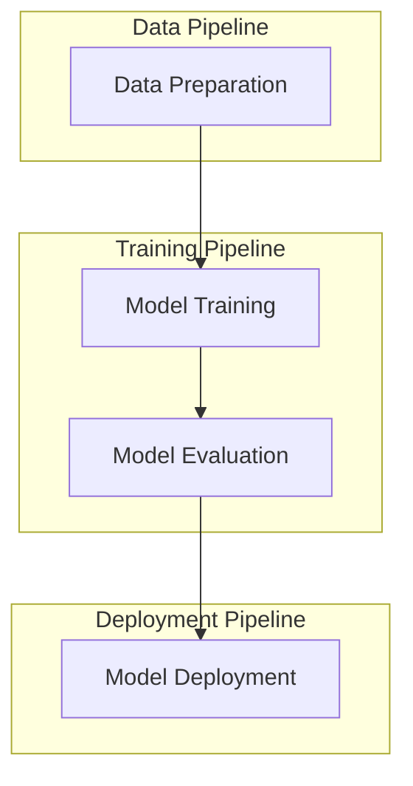
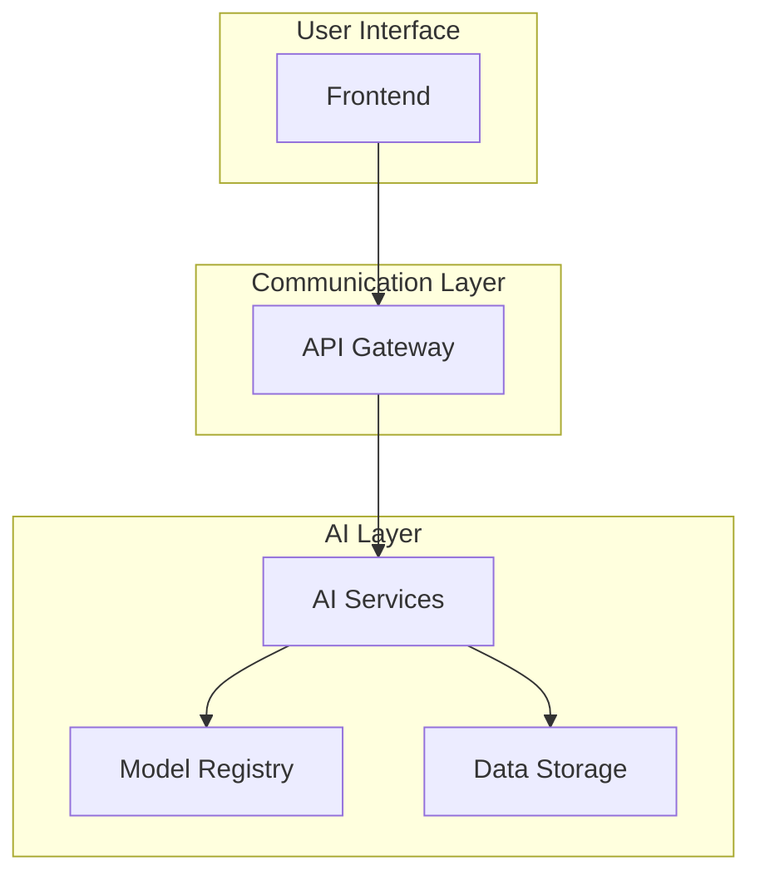
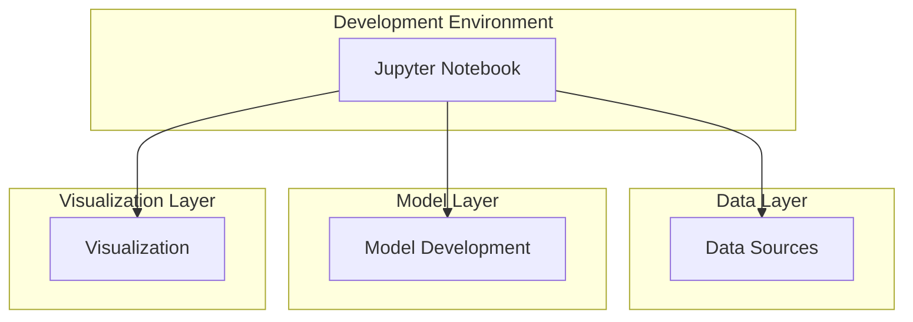
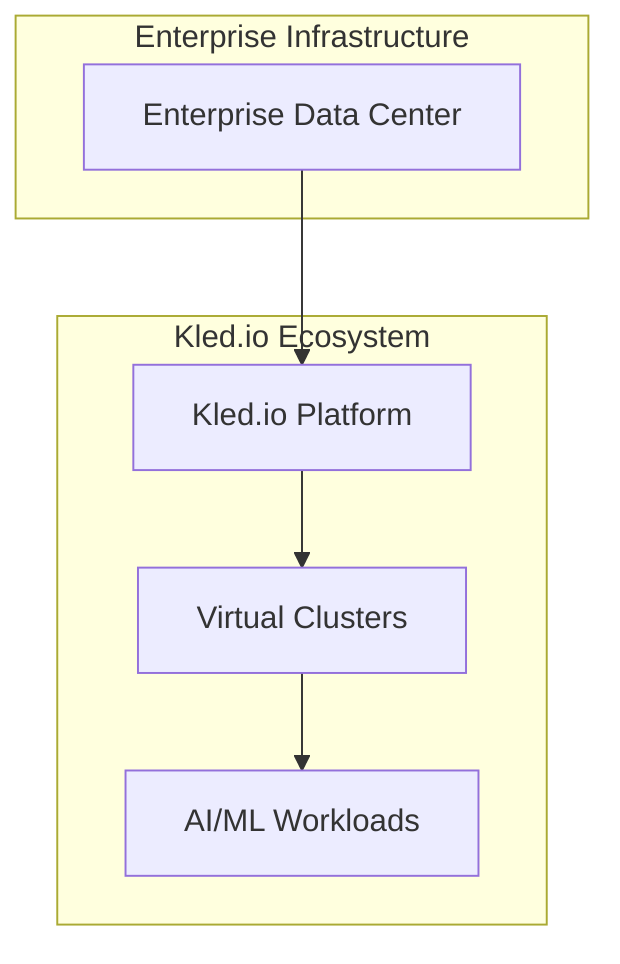
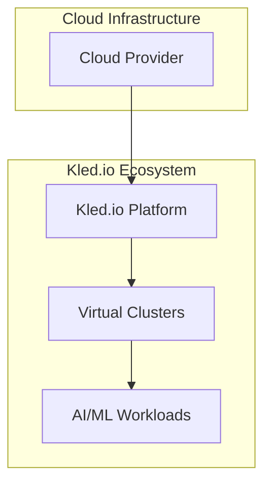
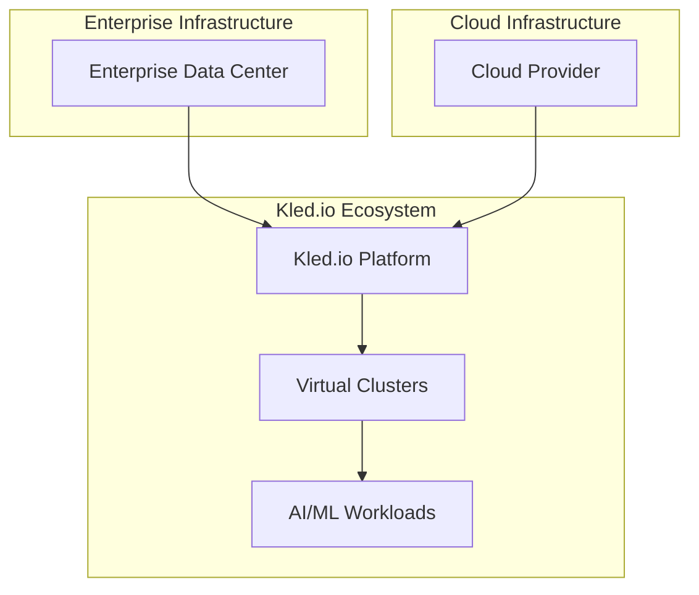

# Enterprise AI/ML

## Overview

The Kled.io Ecosystem provides a comprehensive platform for enterprise AI/ML deployment and management. By leveraging the power of virtual clusters, the pure Rust communication layer, and the Flutter UI ecosystem, Kled.io enables enterprises to deploy and manage AI/ML workloads with unprecedented efficiency, security, and scalability.

## Enterprise AI/ML Challenges

Enterprises face numerous challenges when deploying and managing AI/ML workloads:

```mermaid
graph TD
    A[Enterprise AI/ML Challenges] --> B[Infrastructure Complexity]
    A --> C[Security Concerns]
    A --> D[Resource Utilization]
    A --> E[Scalability Issues]
    A --> F[Development Workflow]
    A --> G[Cross-Platform Support]

    B --> B1[Multiple Environments]
    B --> B2[Heterogeneous Infrastructure]
    B --> B3[Dependency Management]

    C --> C1[Data Privacy]
    C --> C2[Access Control]
    C --> C3[Compliance Requirements]

    D --> D1[Resource Allocation]
    D --> D2[Cost Optimization]
    D --> D3[Performance Tuning]

    E --> E1[Horizontal Scaling]
    E --> E2[Vertical Scaling]
    E --> E3[Auto-Scaling]

    F --> F1[Development Environment]
    F --> F2[Testing Environment]
    F --> F3[Production Environment]

    G --> G1[Web Support]
    G --> G2[Mobile Support]
    G --> G3[Desktop Support]
```

The Kled.io Ecosystem addresses these challenges through a comprehensive set of features and capabilities designed specifically for enterprise AI/ML deployments.

## Kled.io Solution

The Kled.io Ecosystem provides a comprehensive solution for enterprise AI/ML deployment and management:

```mermaid
graph TD
    A[Kled.io Solution] --> B[Virtual Cluster Technology]
    A --> C[Pure Rust Communication]
    A --> D[Flutter UI Ecosystem]
    A --> E[Triple Pipeline Architecture]
    A --> F[Security Architecture]
    A --> G[Scalability Architecture]

    B --> B1[Resource Efficiency]
    B --> B2[Isolation]
    B --> B3[Portability]

    C --> C1[Performance]
    C --> C2[Security]
    C --> C3[Reliability]

    D --> D1[Cross-Platform]
    D --> D2[Consistent UX]
    D --> D3[Native Performance]

    E --> E1[Development]
    E --> E2[Deployment]
    E --> E3[Management]

    F --> F1[Authentication]
    F --> F2[Authorization]
    F --> F3[Encryption]

    G --> G1[Horizontal Scaling]
    G --> G2[Vertical Scaling]
    G --> G3[Auto-Scaling]
```

By addressing the key challenges faced by enterprises in deploying and managing AI/ML workloads, the Kled.io Ecosystem enables organizations to focus on their core business objectives rather than infrastructure management.

## Key Features for Enterprise AI/ML

### Secure Isolation

The Kled.io Ecosystem provides secure isolation for AI/ML workloads, ensuring that sensitive data and models are protected:

- **Virtual Cluster Isolation**: Each AI/ML workload runs in its own virtual cluster, providing strong isolation from other workloads.
- **Namespace Isolation**: Within each virtual cluster, namespaces provide additional isolation between components.
- **Network Isolation**: Network policies control communication between components, preventing unauthorized access.

### Resource Optimization

The Kled.io Ecosystem optimizes resource utilization for AI/ML workloads, reducing costs and improving performance:

- **Resource Quotas**: Resource quotas ensure that each workload has the resources it needs without overprovisioning.
- **Auto-Scaling**: Auto-scaling adjusts resources based on demand, ensuring optimal performance without waste.
- **Resource Sharing**: Virtual clusters share underlying infrastructure, maximizing resource utilization.

### Development Workflow

The Kled.io Ecosystem provides a streamlined development workflow for AI/ML applications:

- **Workspace Management**: Developers can create isolated workspaces for development, testing, and production.
- **CI/CD Integration**: The platform integrates with CI/CD pipelines for automated testing and deployment.
- **Version Control**: The platform integrates with version control systems for tracking changes and collaboration.

### Cross-Platform Support

The Kled.io Ecosystem provides cross-platform support for AI/ML applications:

- **Web Support**: The Flutter UI ecosystem enables web-based access to AI/ML applications.
- **Mobile Support**: The Flutter UI ecosystem enables mobile access to AI/ML applications.
- **Desktop Support**: The Flutter UI ecosystem enables desktop access to AI/ML applications.

## Enterprise AI/ML Use Cases

### Machine Learning Model Training

The Kled.io Ecosystem provides a comprehensive platform for training machine learning models:

- **Data Preparation**: The platform provides tools for data cleaning, transformation, and augmentation.
- **Model Training**: The platform provides scalable resources for training machine learning models.
- **Model Evaluation**: The platform provides tools for evaluating model performance and comparing models.
- **Model Deployment**: The platform provides a streamlined process for deploying models to production.

### AI-Powered Applications

The Kled.io Ecosystem enables the development and deployment of AI-powered applications:

- **Frontend**: The Flutter UI ecosystem provides a cross-platform frontend for AI-powered applications.
- **API Gateway**: The Gateway System provides a centralized point for managing communication between components.
- **AI Services**: The platform provides a range of AI services, from natural language processing to computer vision.
- **Model Registry**: The platform provides a registry for managing and versioning AI models.
- **Data Storage**: The platform provides secure and scalable storage for AI data.

### Data Science Workbenches

The Kled.io Ecosystem provides data science workbenches for exploratory data analysis and model development:

- **Jupyter Notebook**: The platform provides Jupyter Notebook environments for interactive data analysis and model development.
- **Data Sources**: The platform integrates with a range of data sources, from databases to cloud storage.
- **Model Development**: The platform provides tools for developing and testing machine learning models.
- **Visualization**: The platform provides tools for visualizing data and model results.

## Enterprise AI/ML Deployment Models

### On-Premises Deployment

The Kled.io Ecosystem supports on-premises deployment for enterprises with strict data security requirements:

- **Enterprise Data Center**: The platform runs in the enterprise's own data center, ensuring complete control over data.
- **Kled.io Platform**: The Kled.io Ecosystem provides the platform for AI/ML deployment and management.
- **Virtual Clusters**: Virtual clusters provide isolated environments for different AI/ML workloads.
- **AI/ML Workloads**: AI/ML workloads run in the virtual clusters, with access to enterprise data.

### Cloud Deployment

The Kled.io Ecosystem supports cloud deployment for enterprises seeking scalability and flexibility:

- **Cloud Provider**: The platform runs on a cloud provider, such as AWS, GCP, or Azure.
- **Kled.io Platform**: The Kled.io Ecosystem provides the platform for AI/ML deployment and management.
- **Virtual Clusters**: Virtual clusters provide isolated environments for different AI/ML workloads.
- **AI/ML Workloads**: AI/ML workloads run in the virtual clusters, with access to cloud resources.

### Hybrid Deployment

The Kled.io Ecosystem supports hybrid deployment for enterprises with a mix of on-premises and cloud resources:

- **Enterprise Data Center**: Some components run in the enterprise's own data center.
- **Cloud Provider**: Other components run on a cloud provider.
- **Kled.io Platform**: The Kled.io Ecosystem provides the platform for AI/ML deployment and management.
- **Virtual Clusters**: Virtual clusters provide isolated environments for different AI/ML workloads.
- **AI/ML Workloads**: AI/ML workloads run in the virtual clusters, with access to both on-premises and cloud resources.

## Enterprise AI/ML Security

The Kled.io Ecosystem provides comprehensive security for enterprise AI/ML deployments:

### Authentication and Authorization

The platform provides robust authentication and authorization mechanisms:

- **User Authentication**: Users authenticate using industry-standard protocols, such as OAuth 2.0 and OpenID Connect.
- **Service Authentication**: Services authenticate using mutual TLS and other mechanisms.
- **Role-Based Access Control**: Access to resources is controlled based on user roles.
- **Resource-Based Access Control**: Access to resources is controlled based on resource ownership.

### Data Protection

The platform provides comprehensive data protection:

- **Data Encryption**: Data is encrypted at rest and in transit.
- **Data Isolation**: Data is isolated between different workloads.
- **Data Governance**: The platform provides tools for managing data access and usage.
- **Data Lineage**: The platform tracks the origin and transformation of data.

### Compliance

The platform supports compliance with industry regulations:

- **Audit Logging**: The platform logs all actions for audit purposes.
- **Compliance Reporting**: The platform provides reports for compliance purposes.
- **Policy Enforcement**: The platform enforces security policies.
- **Vulnerability Management**: The platform identifies and addresses security vulnerabilities.

## Conclusion

The Kled.io Ecosystem provides a comprehensive platform for enterprise AI/ML deployment and management. By addressing the key challenges faced by enterprises in deploying and managing AI/ML workloads, the platform enables organizations to focus on their core business objectives rather than infrastructure management. With its secure isolation, resource optimization, streamlined development workflow, and cross-platform support, the Kled.io Ecosystem is the ideal platform for enterprise AI/ML deployments.
