# Roadmap

## Overview

The Kled.io Ecosystem is continuously evolving to meet the needs of enterprises deploying AI and ML solutions. Our roadmap outlines the key initiatives and features planned for future releases, providing a clear vision for the platform's development.

## Strategic Vision

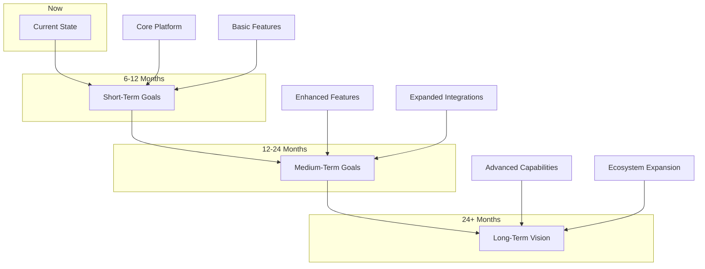

Our strategic vision is to build the most comprehensive platform for AI/ML deployment and development environment management, enabling enterprises to harness the full potential of artificial intelligence and machine learning technologies.

## Short-Term Goals (6-12 Months)

### Enhanced Flutter UI

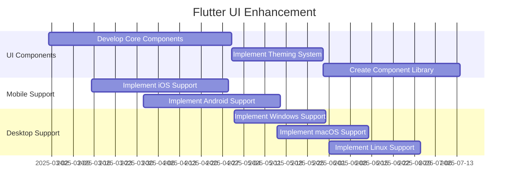

- **Responsive UI Components**: Develop a comprehensive set of responsive UI components for web, mobile, and desktop platforms.
- **Cross-Platform Support**: Enhance support for iOS, Android, Windows, macOS, and Linux platforms.
- **Theming System**: Implement a flexible theming system for customizing the UI to match enterprise branding.
- **Accessibility**: Ensure all UI components meet accessibility standards for users with disabilities.

### Virtual Cluster Enhancements

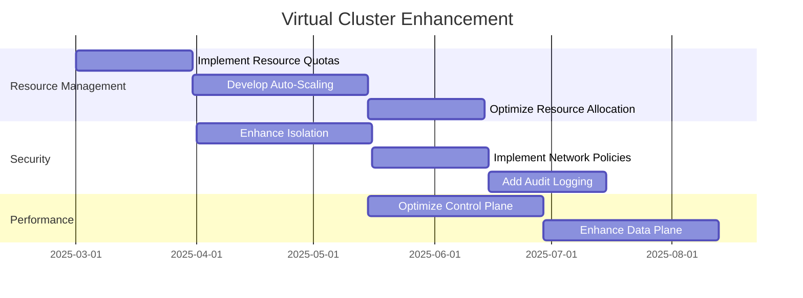

- **Resource Quotas**: Implement resource quotas for virtual clusters to ensure fair allocation of resources.
- **Auto-Scaling**: Develop auto-scaling capabilities for virtual clusters based on workload demands.
- **Enhanced Isolation**: Strengthen isolation between virtual clusters for improved security.
- **Performance Optimization**: Optimize the performance of virtual clusters for AI/ML workloads.

### CLI Improvements

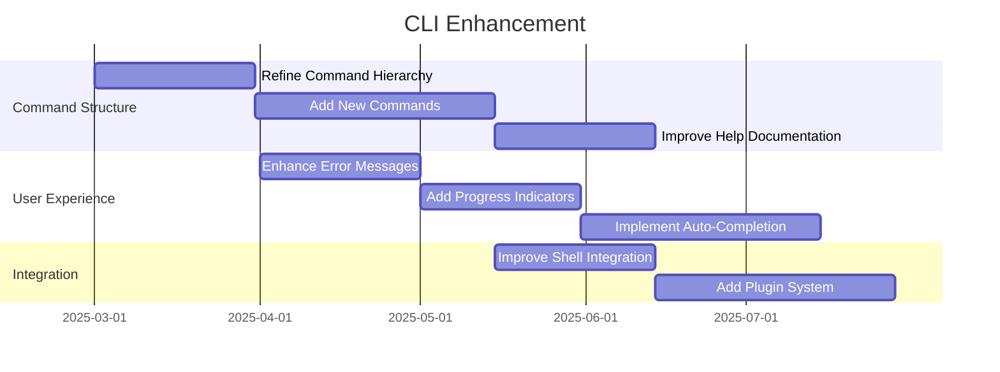

- **Command Structure**: Refine the command structure for improved usability and discoverability.
- **User Experience**: Enhance error messages, add progress indicators, and implement auto-completion.
- **Plugin System**: Develop a plugin system for extending CLI functionality.
- **Shell Integration**: Improve integration with popular shells for a seamless experience.

## Medium-Term Goals (12-24 Months)

### AI/ML Tooling Integration

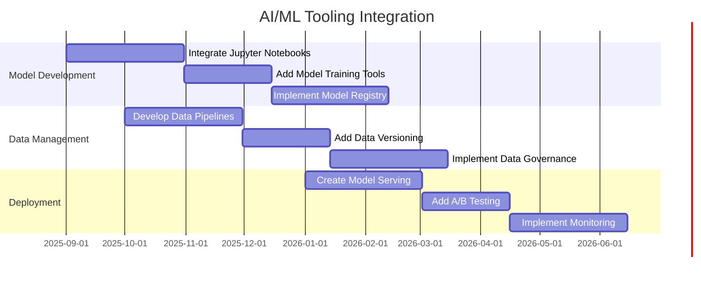

- **Jupyter Integration**: Integrate Jupyter Notebooks for interactive data analysis and model development.
- **Model Registry**: Implement a model registry for managing and versioning AI/ML models.
- **Data Pipelines**: Develop data pipelines for preprocessing and transforming data for AI/ML workloads.
- **Model Serving**: Create a model serving platform for deploying AI/ML models to production.

### Multi-Cloud Support

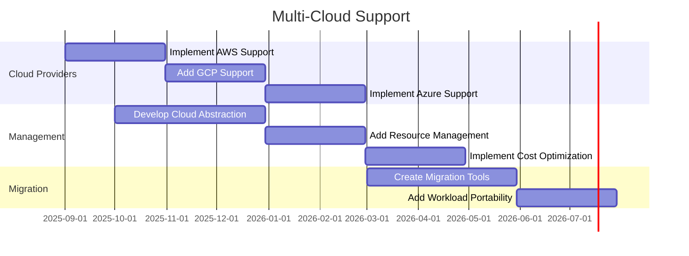

- **Cloud Provider Support**: Expand support for major cloud providers, including AWS, GCP, and Azure.
- **Cloud Abstraction**: Develop a cloud abstraction layer for consistent management across providers.
- **Resource Management**: Add resource management capabilities for optimizing cloud resource usage.
- **Migration Tools**: Create tools for migrating workloads between cloud providers.

### Enterprise Features

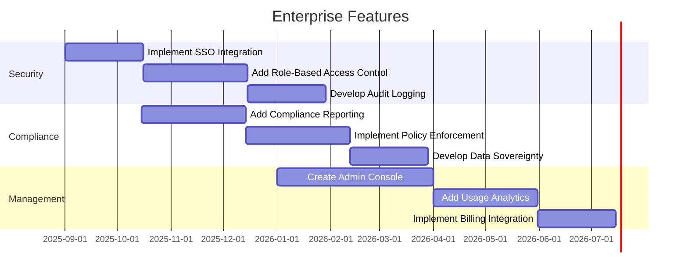

- **Single Sign-On**: Implement SSO integration for enterprise authentication.
- **Role-Based Access Control**: Add RBAC for fine-grained access control.
- **Compliance Reporting**: Develop compliance reporting for regulatory requirements.
- **Admin Console**: Create an admin console for managing the Kled.io Ecosystem.

## Long-Term Vision (24+ Months)

### AI-Powered Platform

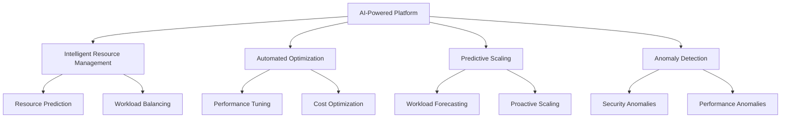

- **Intelligent Resource Management**: Use AI to predict resource needs and optimize allocation.
- **Automated Optimization**: Automatically tune system parameters for optimal performance.
- **Predictive Scaling**: Proactively scale resources based on predicted workload patterns.
- **Anomaly Detection**: Identify security and performance anomalies before they impact operations.

### Edge Computing Integration

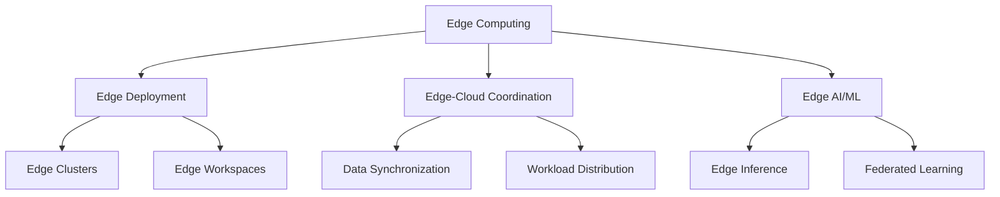

- **Edge Deployment**: Enable deployment of workloads to edge devices and clusters.
- **Edge-Cloud Coordination**: Coordinate workloads between edge and cloud environments.
- **Edge AI/ML**: Support AI/ML workloads on edge devices with limited resources.
- **Federated Learning**: Implement federated learning for training models across distributed edge devices.

### Ecosystem Expansion

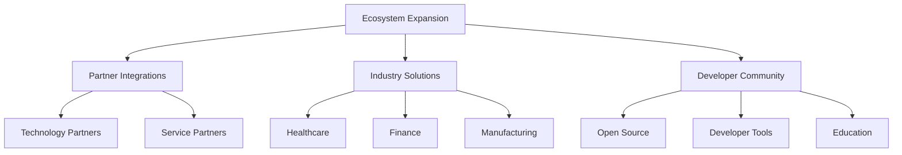

- **Partner Integrations**: Expand integrations with technology and service partners.
- **Industry Solutions**: Develop industry-specific solutions for healthcare, finance, manufacturing, and more.
- **Developer Community**: Build a vibrant developer community around the Kled.io Ecosystem.
- **Open Source**: Contribute to and leverage open source projects for mutual benefit.

## Release Schedule

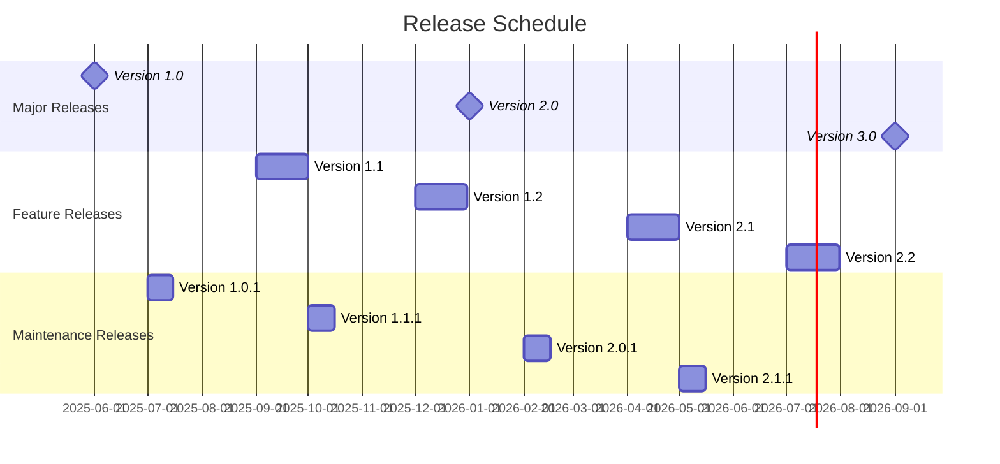

- **Major Releases**: Major releases (1.0, 2.0, 3.0) introduce significant new features and capabilities.
- **Feature Releases**: Feature releases (1.1, 1.2, 2.1, 2.2) add new features and enhancements.
- **Maintenance Releases**: Maintenance releases (1.0.1, 1.1.1, 2.0.1, 2.1.1) provide bug fixes and minor improvements.

## Feedback and Prioritization

We value feedback from our users and partners, and we use this feedback to prioritize our roadmap. If you have suggestions for features or improvements, please share them with us through the following channels:

- **GitHub Issues**: Submit feature requests and bug reports through our GitHub repositories.
- **Community Forums**: Discuss ideas and provide feedback in our community forums.
- **Direct Feedback**: Contact us directly with your feedback and suggestions.

## Conclusion

The Kled.io Ecosystem roadmap outlines our vision for the future of the platform, with a focus on enhancing the user experience, expanding capabilities, and addressing the evolving needs of enterprises deploying AI and ML solutions. We are committed to delivering a comprehensive platform that enables enterprises to harness the full potential of artificial intelligence and machine learning technologies.
