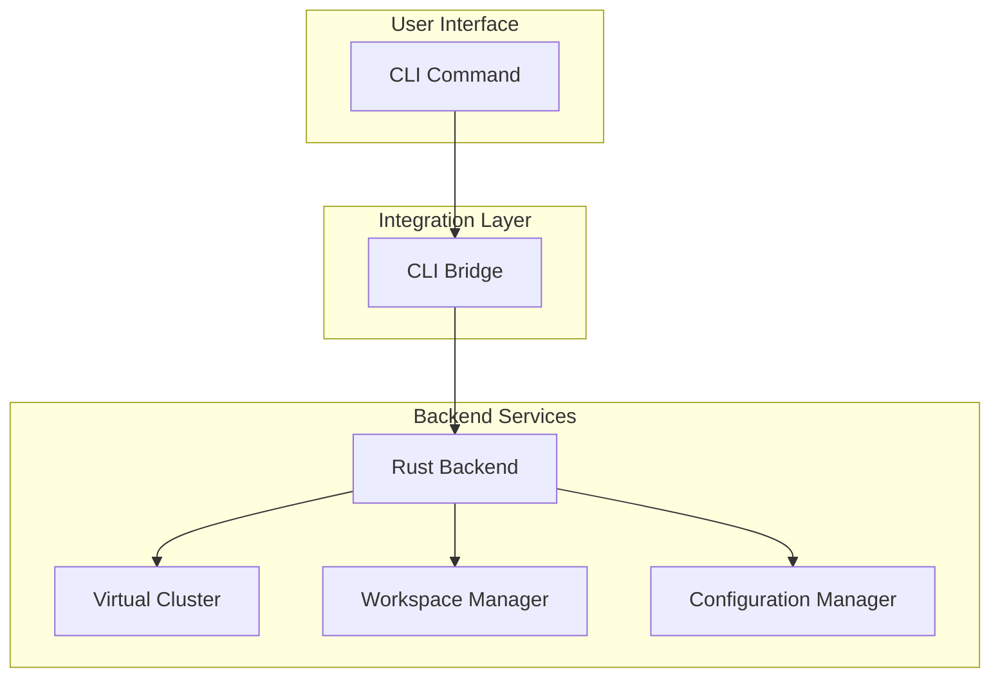

# CLI Architecture

## Overview

The Kled.io CLI provides a powerful interface for managing workspaces, virtual clusters, and development environments. Built with Go and Cobra, the CLI offers a comprehensive set of commands for interacting with the Kled.io Ecosystem.

## Architecture



The CLI architecture is designed to provide a seamless interface between the user and the Kled.io Ecosystem. The CLI commands are processed by the CLI Bridge, which communicates with the Rust backend to execute the requested operations.

## Command Structure

The Kled.io CLI follows a hierarchical command structure, with top-level commands representing major functionality areas and subcommands providing specific operations:

```
kled
├── workspace
│   ├── create
│   ├── list
│   ├── delete
│   ├── start
│   ├── stop
│   └── exec
├── cluster
│   ├── create
│   ├── list
│   ├── delete
│   ├── start
│   ├── stop
│   └── info
├── config
│   ├── set
│   ├── get
│   ├── list
│   └── import
└── version
```

## Key Components

### Command Definitions

The CLI commands are defined using Cobra, a powerful library for creating modern CLI applications:

```go
package cmd

import (
	"fmt"
	"os"

	"github.com/spf13/cobra"
)

var rootCmd = &cobra.Command{
	Use:   "kled",
	Short: "Kled.io CLI",
	Long:  `Kled.io CLI provides a command-line interface for managing the Kled.io Ecosystem.`,
}

func Execute() {
	if err := rootCmd.Execute(); err != nil {
		fmt.Println(err)
		os.Exit(1)
	}
}

func init() {
	rootCmd.AddCommand(workspaceCmd)
	rootCmd.AddCommand(clusterCmd)
	rootCmd.AddCommand(configCmd)
	rootCmd.AddCommand(versionCmd)
}
```

### Workspace Commands

The workspace commands enable users to create, manage, and interact with development workspaces:

```go
var workspaceCmd = &cobra.Command{
	Use:   "workspace",
	Short: "Manage workspaces",
	Long:  `Manage development workspaces in the Kled.io Ecosystem.`,
}

var workspaceCreateCmd = &cobra.Command{
	Use:   "create [name]",
	Short: "Create a new workspace",
	Args:  cobra.ExactArgs(1),
	RunE: func(cmd *cobra.Command, args []string) error {
		name := args[0]

		// Get flags
		repo, _ := cmd.Flags().GetString("repo")
		cluster, _ := cmd.Flags().GetString("cluster")

		// Create the workspace
		err := client.CreateWorkspace(name, repo, cluster)
		if err != nil {
			return err
		}

		fmt.Printf("Workspace %s created successfully\n", name)
		return nil
	},
}

func init() {
	workspaceCmd.AddCommand(workspaceCreateCmd)
	workspaceCmd.AddCommand(workspaceListCmd)
	workspaceCmd.AddCommand(workspaceDeleteCmd)
	workspaceCmd.AddCommand(workspaceStartCmd)
	workspaceCmd.AddCommand(workspaceStopCmd)
	workspaceCmd.AddCommand(workspaceExecCmd)

	workspaceCreateCmd.Flags().String("repo", "", "Repository URL")
	workspaceCreateCmd.Flags().String("cluster", "", "Virtual cluster name")
}
```

### Cluster Commands

The cluster commands enable users to create, manage, and interact with virtual clusters:

```go
var clusterCmd = &cobra.Command{
	Use:   "cluster",
	Short: "Manage virtual clusters",
	Long:  `Manage virtual clusters in the Kled.io Ecosystem.`,
}

var clusterCreateCmd = &cobra.Command{
	Use:   "create [name]",
	Short: "Create a new virtual cluster",
	Args:  cobra.ExactArgs(1),
	RunE: func(cmd *cobra.Command, args []string) error {
		name := args[0]

		// Get flags
		size, _ := cmd.Flags().GetString("size")

		// Create the virtual cluster
		err := client.CreateVirtualCluster(name, size)
		if err != nil {
			return err
		}

		fmt.Printf("Virtual cluster %s created successfully\n", name)
		return nil
	},
}

func init() {
	clusterCmd.AddCommand(clusterCreateCmd)
	clusterCmd.AddCommand(clusterListCmd)
	clusterCmd.AddCommand(clusterDeleteCmd)
	clusterCmd.AddCommand(clusterStartCmd)
	clusterCmd.AddCommand(clusterStopCmd)
	clusterCmd.AddCommand(clusterInfoCmd)

	clusterCreateCmd.Flags().String("size", "small", "Cluster size (small, medium, large)")
}
```

### Configuration Commands

The configuration commands enable users to manage their Kled.io configuration:

```go
var configCmd = &cobra.Command{
	Use:   "config",
	Short: "Manage configuration",
	Long:  `Manage Kled.io configuration settings.`,
}

var configSetCmd = &cobra.Command{
	Use:   "set [key] [value]",
	Short: "Set a configuration value",
	Args:  cobra.ExactArgs(2),
	RunE: func(cmd *cobra.Command, args []string) error {
		key := args[0]
		value := args[1]

		// Set the configuration value
		err := client.SetConfig(key, value)
		if err != nil {
			return err
		}

		fmt.Printf("Configuration %s set to %s\n", key, value)
		return nil
	},
}

func init() {
	configCmd.AddCommand(configSetCmd)
	configCmd.AddCommand(configGetCmd)
	configCmd.AddCommand(configListCmd)
	configCmd.AddCommand(configImportCmd)
}
```

## CLI Bridge

The CLI Bridge provides a seamless interface between the Go-based CLI and the Rust backend, enabling efficient command execution and data exchange:

```rust
pub struct CliBridge {
    /// CLI configuration
    config: CliConfig,
}

impl CliBridge {
    /// Create a new CLI bridge
    pub fn new(config: CliConfig) -> Self {
        Self { config }
    }

    /// Initialize the CLI bridge
    pub async fn init(&self) -> Result<()> {
        // Initialize observability
        init_observability(self.config.observability.clone())
            .context("Failed to initialize observability")?;

        info!("Initializing Kled.io CLI bridge");

        Ok(())
    }

    /// Run the CLI bridge
    pub async fn run(&self) -> Result<()> {
        // Create the router
        let app = Router::new()
            .route("/", get(|| async { "Kled.io CLI Bridge" }))
            .route("/health", get(|| async { "OK" }))
            .route("/workspace/create", post(create_workspace))
            .route("/workspace/list", get(list_workspaces))
            .route("/workspace/delete", post(delete_workspace))
            .route("/cluster/create", post(create_cluster))
            .route("/cluster/list", get(list_clusters))
            .route("/cluster/delete", post(delete_cluster))
            .route("/config/set", post(set_config))
            .route("/config/get", get(get_config))
            .route("/config/list", get(list_config));

        // Start the HTTP server
        let http_addr = self.config.http_addr;
        info!("Starting HTTP server on {}", http_addr);

        let http_server = axum::Server::bind(&http_addr)
            .serve(app.clone().into_make_service());

        http_server.await.context("HTTP server error")?;

        Ok(())
    }
}

/// Create a workspace
async fn create_workspace(
    Json(payload): Json<CreateWorkspaceRequest>,
) -> Result<Json<CreateWorkspaceResponse>, StatusCode> {
    // Create the workspace
    let workspace = Workspace::create(payload.name, payload.repo, payload.cluster)
        .await
        .map_err(|_| StatusCode::INTERNAL_SERVER_ERROR)?;

    // Return the response
    Ok(Json(CreateWorkspaceResponse {
        id: workspace.id,
        name: workspace.name,
        status: workspace.status,
    }))
}
```

## Usage Examples

### Creating a Workspace

```bash
# Create a workspace from a Git repository
kled workspace create my-workspace --repo https://github.com/user/repo --cluster my-cluster

# Create a workspace from a local directory
kled workspace create my-workspace --local ./path/to/directory --cluster my-cluster

# Create a workspace with a specific image
kled workspace create my-workspace --image kled/workspace:latest --cluster my-cluster
```

### Managing Virtual Clusters

```bash
# Create a virtual cluster
kled cluster create my-cluster --size medium

# List virtual clusters
kled cluster list

# Get information about a virtual cluster
kled cluster info my-cluster

# Delete a virtual cluster
kled cluster delete my-cluster
```

### Managing Configuration

```bash
# Set a configuration value
kled config set registry.url https://registry.kled.io

# Get a configuration value
kled config get registry.url

# List all configuration values
kled config list

# Import configuration from a file
kled config import config.yaml
```

## Conclusion

The Kled.io CLI provides a powerful and flexible interface for interacting with the Kled.io Ecosystem. By leveraging Go and Cobra for the command-line interface and integrating with the Rust backend through the CLI Bridge, the CLI enables users to manage workspaces, virtual clusters, and configuration with ease.
