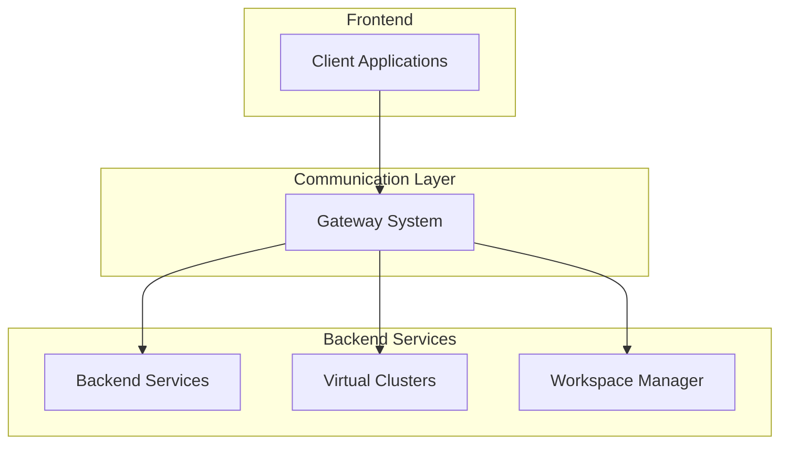

# Gateway System

## Overview

The Gateway System is a key component of the Kled.io Ecosystem, providing a centralized point for managing communication between different parts of the system. Built on Aclix Web Servers and leveraging the pure Rust communication layer, the Gateway System enables seamless integration between the frontend and backend components.

## Architecture



The Gateway System sits at the heart of the Kled.io Ecosystem, providing a unified interface for client applications to interact with backend services. This architecture enables seamless communication between different parts of the system while ensuring optimal performance and security.

## Key Components

### HTTP Server

The HTTP Server provides a RESTful API for client applications to interact with the Kled.io Ecosystem:

```rust
// Create the router
let app = Router::new()
    .route("/", get(|| async { "Kled.io Gateway" }))
    .route("/health", get(|| async { "OK" }))
    .route("/api/v1/workspaces", get(list_workspaces))
    .route("/api/v1/workspaces/:id", get(get_workspace))
    .route("/api/v1/workspaces", post(create_workspace))
    .route("/api/v1/workspaces/:id", delete(delete_workspace))
    .route("/api/v1/clusters", get(list_clusters))
    .route("/api/v1/clusters/:id", get(get_cluster))
    .route("/api/v1/clusters", post(create_cluster))
    .route("/api/v1/clusters/:id", delete(delete_cluster));

// Start the HTTP server
let http_addr = "127.0.0.1:3000".parse()?;
let http_server = axum::Server::bind(&http_addr)
    .serve(app.clone().into_make_service());
```

### Unix Domain Socket

The Unix Domain Socket provides a high-performance communication channel for local services to interact with the Kled.io Ecosystem:

```rust
// Create a Unix Domain Socket
let uds = UnixDomainSocket::new("/path/to/socket");

// Bind the socket
let listener = uds.bind().await?;

// Accept connections
let uds_server = UnixDomainSocket::accept_loop(listener);
```

### Gateway Configuration

The Gateway Configuration provides a flexible way to configure the Gateway System:

```rust
/// Gateway configuration
#[derive(Debug, Clone, Serialize, Deserialize)]
pub struct GatewayConfig {
    /// HTTP server address
    pub http_addr: SocketAddr,
    /// Unix domain socket path
    pub uds_path: Option<String>,
    /// Observability configuration
    pub observability: KledObservabilityConfig,
}

impl Default for GatewayConfig {
    fn default() -> Self {
        Self {
            http_addr: "127.0.0.1:3000".parse().unwrap(),
            uds_path: None,
            observability: KledObservabilityConfig::default(),
        }
    }
}
```

## Implementation Details

### Gateway Server

The Gateway Server is the main component of the Gateway System, responsible for managing communication between different parts of the system:

```rust
/// Gateway server
pub struct Gateway {
    /// Gateway configuration
    config: GatewayConfig,
}

impl Gateway {
    /// Create a new gateway server
    pub fn new(config: GatewayConfig) -> Self {
        Self { config }
    }

    /// Initialize the gateway
    pub async fn init(&self) -> Result<()> {
        // Initialize observability
        init_observability(self.config.observability.clone())
            .context("Failed to initialize observability")?;

        info!("Initializing Kled.io gateway");

        Ok(())
    }

    /// Run the gateway server
    pub async fn run(&self) -> Result<()> {
        // Create the router
        let app = Router::new()
            .route("/", get(|| async { "Kled.io Gateway" }))
            .route("/health", get(|| async { "OK" }));

        // Start the HTTP server
        let http_addr = self.config.http_addr;
        info!("Starting HTTP server on {}", http_addr);

        let http_server = axum::Server::bind(&http_addr)
            .serve(app.clone().into_make_service());

        // Start the Unix domain socket server if configured
        let uds_server = if let Some(uds_path) = &self.config.uds_path {
            info!("Starting Unix domain socket server on {}", uds_path);

            let uds = UnixDomainSocket::new(uds_path);
            let listener = uds.bind().await
                .context("Failed to bind Unix domain socket")?;

            let uds_server = UnixDomainSocket::accept_loop(listener);
            Some(uds_server)
        } else {
            None
        };

        // Run the servers
        if let Some(uds_server) = uds_server {
            tokio::select! {
                result = http_server => {
                    result.context("HTTP server error")?;
                }
                _ = uds_server => {
                    error!("Unix domain socket server exited unexpectedly");
                }
            }
        } else {
            http_server.await.context("HTTP server error")?;
        }

        Ok(())
    }
}
```

### API Handlers

The API Handlers process requests from client applications and interact with backend services:

```rust
/// List workspaces
async fn list_workspaces() -> Result<Json<Vec<Workspace>>, StatusCode> {
    // Get workspaces from the database
    let workspaces = Workspace::list()
        .await
        .map_err(|_| StatusCode::INTERNAL_SERVER_ERROR)?;

    // Return the workspaces
    Ok(Json(workspaces))
}

/// Get a workspace
async fn get_workspace(Path(id): Path<String>) -> Result<Json<Workspace>, StatusCode> {
    // Get the workspace from the database
    let workspace = Workspace::get(&id)
        .await
        .map_err(|_| StatusCode::INTERNAL_SERVER_ERROR)?
        .ok_or(StatusCode::NOT_FOUND)?;

    // Return the workspace
    Ok(Json(workspace))
}

/// Create a workspace
async fn create_workspace(
    Json(payload): Json<CreateWorkspaceRequest>,
) -> Result<Json<Workspace>, StatusCode> {
    // Create the workspace
    let workspace = Workspace::create(payload.name, payload.repo, payload.cluster)
        .await
        .map_err(|_| StatusCode::INTERNAL_SERVER_ERROR)?;

    // Return the workspace
    Ok(Json(workspace))
}

/// Delete a workspace
async fn delete_workspace(Path(id): Path<String>) -> Result<StatusCode, StatusCode> {
    // Delete the workspace
    Workspace::delete(&id)
        .await
        .map_err(|_| StatusCode::INTERNAL_SERVER_ERROR)?;

    // Return success
    Ok(StatusCode::NO_CONTENT)
}
```

### Middleware

The Middleware provides additional functionality for the Gateway System, such as authentication, logging, and error handling:

```rust
/// Authentication middleware
async fn authenticate<B>(
    TypedHeader(auth): TypedHeader<Authorization<Bearer>>,
    request: Request<B>,
    next: Next<B>,
) -> Result<Response, StatusCode> {
    // Validate the token
    let token = auth.token();
    if !is_valid_token(token) {
        return Err(StatusCode::UNAUTHORIZED);
    }

    // Continue with the request
    Ok(next.run(request).await)
}

/// Logging middleware
async fn log<B>(request: Request<B>, next: Next<B>) -> Response {
    // Log the request
    info!("Request: {} {}", request.method(), request.uri());

    // Continue with the request
    let response = next.run(request).await;

    // Log the response
    info!("Response: {}", response.status());

    response
}

/// Error handling middleware
async fn handle_error<B>(
    request: Request<B>,
    next: Next<B>,
) -> Result<Response, StatusCode> {
    // Continue with the request
    let response = next.run(request).await;

    // Check if the response is an error
    if response.status().is_client_error() || response.status().is_server_error() {
        error!("Error: {}", response.status());
    }

    Ok(response)
}
```

## Benefits

### Performance

The Gateway System provides exceptional performance, with low latency and high throughput:

- **Unix Domain Sockets**: The Gateway System uses Unix Domain Sockets for local communication, providing higher performance than traditional network sockets.
- **Rust Implementation**: The Gateway System is implemented in Rust, providing memory safety and high performance.
- **Asynchronous Processing**: The Gateway System uses asynchronous processing to handle multiple requests concurrently.

### Security

The Gateway System provides strong security features to protect the Kled.io Ecosystem:

- **Authentication**: The Gateway System authenticates requests to ensure that only authorized users can access the system.
- **Authorization**: The Gateway System authorizes requests to ensure that users can only access resources they are permitted to access.
- **Encryption**: The Gateway System encrypts data in transit to protect sensitive information.

### Scalability

The Gateway System is designed to scale with the Kled.io Ecosystem:

- **Horizontal Scaling**: The Gateway System can be scaled horizontally by adding more instances.
- **Load Balancing**: The Gateway System can distribute requests across multiple instances to balance the load.
- **Resource Efficiency**: The Gateway System uses resources efficiently to maximize throughput.

## Integration with Other Components

### Frontend Integration

The Gateway System integrates with the frontend components through the HTTP API:

```typescript
// Create a workspace
async function createWorkspace(name: string, repo: string, cluster: string): Promise<Workspace> {
    const response = await fetch('/api/v1/workspaces', {
        method: 'POST',
        headers: {
            'Content-Type': 'application/json',
            'Authorization': `Bearer ${token}`,
        },
        body: JSON.stringify({
            name,
            repo,
            cluster,
        }),
    });

    if (!response.ok) {
        throw new Error(`Failed to create workspace: ${response.statusText}`);
    }

    return response.json();
}

// List workspaces
async function listWorkspaces(): Promise<Workspace[]> {
    const response = await fetch('/api/v1/workspaces', {
        headers: {
            'Authorization': `Bearer ${token}`,
        },
    });

    if (!response.ok) {
        throw new Error(`Failed to list workspaces: ${response.statusText}`);
    }

    return response.json();
}
```

### Backend Integration

The Gateway System integrates with the backend components through the Rust API:

```rust
// Create a workspace
pub async fn create_workspace(name: String, repo: String, cluster: String) -> Result<Workspace> {
    // Create the workspace in the database
    let workspace = Workspace::create(name, repo, cluster).await?;

    // Create the workspace in the virtual cluster
    let cluster = VirtualCluster::get(&cluster).await?;
    cluster.create_workspace(&workspace).await?;

    // Return the workspace
    Ok(workspace)
}

// List workspaces
pub async fn list_workspaces() -> Result<Vec<Workspace>> {
    // Get workspaces from the database
    let workspaces = Workspace::list().await?;

    // Return the workspaces
    Ok(workspaces)
}
```

## Conclusion

The Gateway System is a fundamental component of the Kled.io Ecosystem, providing a centralized point for managing communication between different parts of the system. By leveraging Aclix Web Servers and the pure Rust communication layer, the Gateway System enables seamless integration between the frontend and backend components, ensuring optimal performance, security, and scalability.
