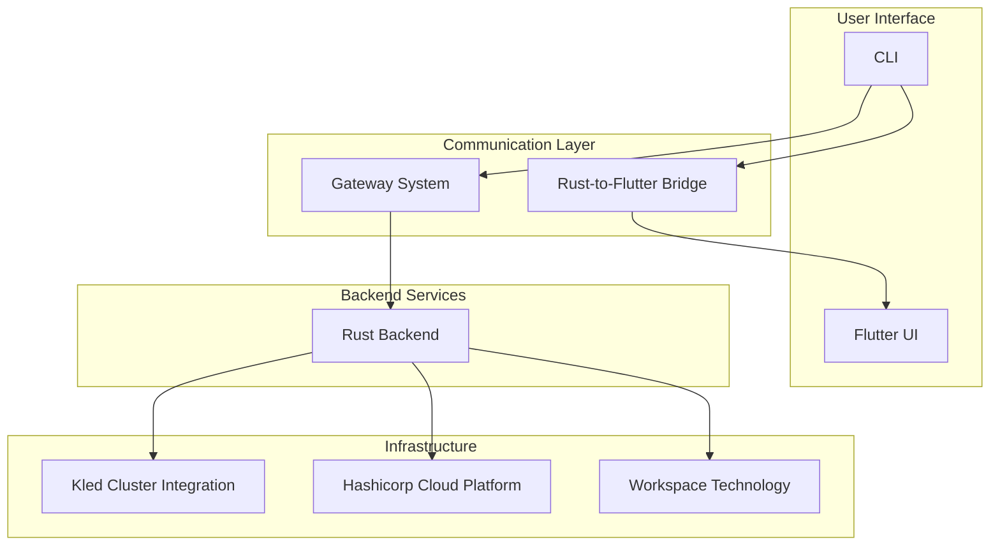
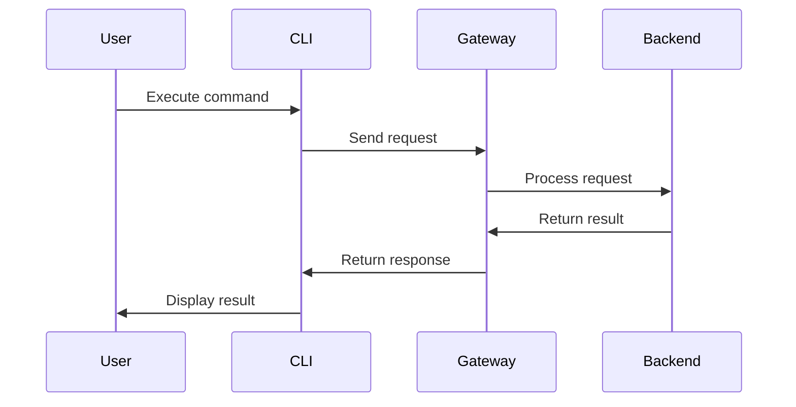
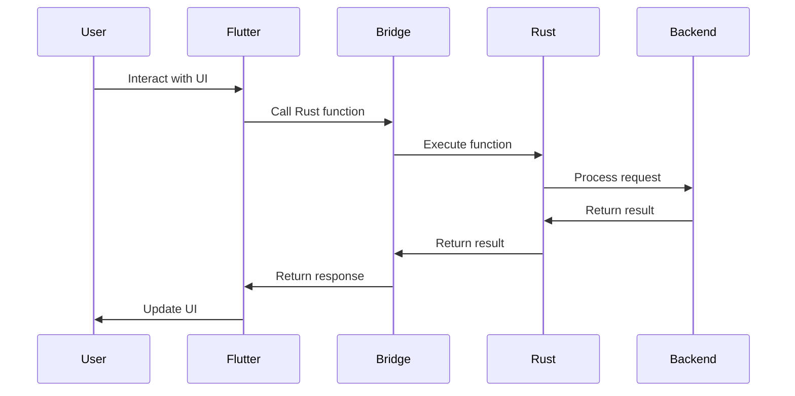
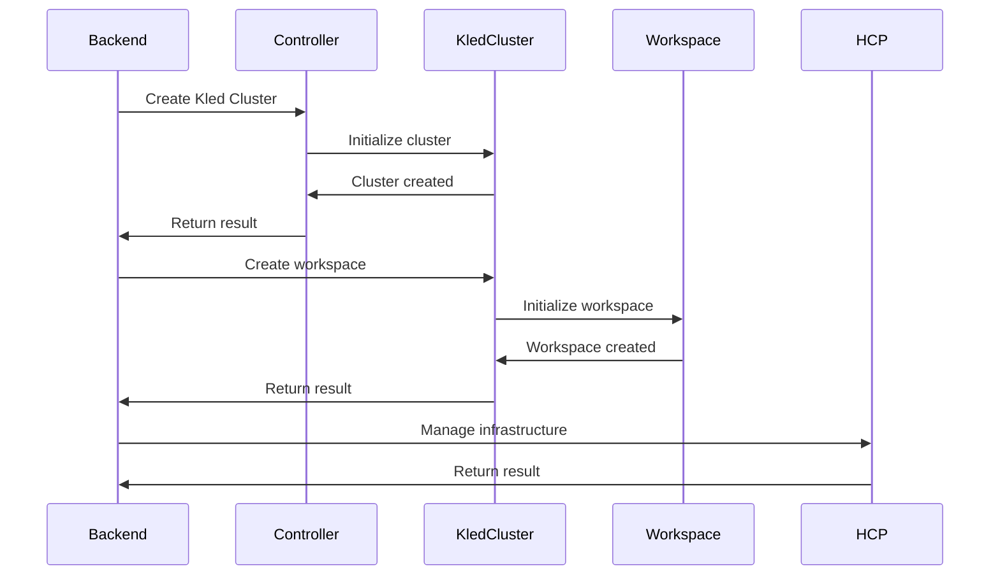
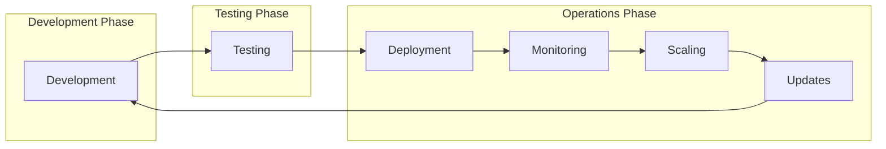
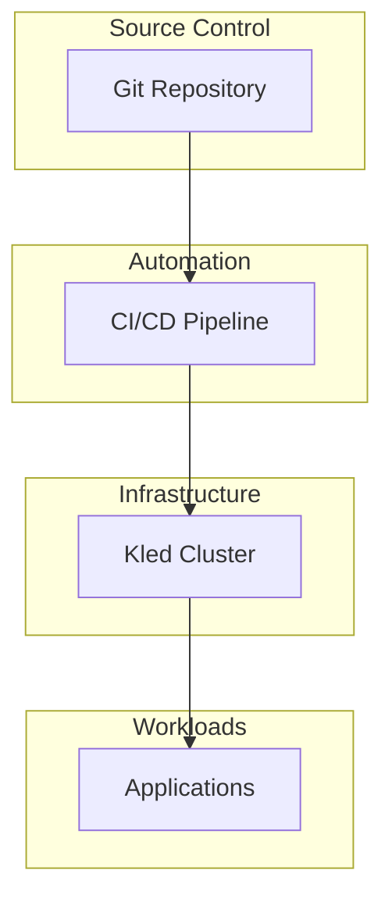

# Technical Components

The Kled.io Ecosystem is built on a set of powerful technical components that work together to provide a comprehensive platform for AI/ML deployment and development environment management. This section provides detailed information about each of these components.

## Component Overview

The Kled.io Ecosystem is composed of several key technical components, each with its own responsibilities and features. These components work together to provide a seamless experience for users, from the command-line interface to the Kled Cluster infrastructure.

## Key Components

### [CLI Architecture](./cli.md)

The CLI provides a powerful interface for managing workspaces, Kled Clusters, and development environments. Built with Go and Cobra, the CLI offers a comprehensive set of commands for interacting with the Kled.io Ecosystem.

Key features:
- Hierarchical command structure for intuitive usage
- Comprehensive set of commands for managing workspaces and Kled Clusters
- Seamless integration with the Rust backend through the CLI Bridge

[Learn more about the CLI Architecture](./cli.md)

### [Gateway System](./gateway.md)

The Gateway System provides a centralized point for managing communication between different parts of the system. Built on Aclix Web Servers and leveraging the pure Rust communication layer, the Gateway System enables seamless integration between the frontend and backend components.

Key features:
- HTTP Server for RESTful API access
- Unix Domain Socket for high-performance local communication
- Flexible configuration options for different deployment scenarios

[Learn more about the Gateway System](./gateway.md)

### [Rust-to-Flutter Bridge](./rust-flutter-bridge.md)

The Rust-to-Flutter Bridge enables seamless integration between the Rust backend and Flutter frontend. This bridge allows for efficient data exchange and function calls between the two environments, providing the performance and security benefits of Rust with the cross-platform UI capabilities of Flutter.

Key features:
- Code generation for type-safe communication
- Efficient data serialization between Rust and Dart
- Comprehensive error handling

[Learn more about the Rust-to-Flutter Bridge](./rust-flutter-bridge.md)

### [Kled Cluster Integration](./kled-cluster-integration.md)

The Kled Cluster Integration provides a secure and efficient environment for running AI/ML workloads. Kled Clusters are fully operable Kubernetes clusters running inside Physical Clusters, enabling enterprises to maximize the value of their infrastructure investments while ensuring the security and performance of their AI/ML applications.

Key features:
- Resource efficiency through shared infrastructure
- Strong isolation between workloads
- Seamless scaling for changing requirements
- Advanced user management and administration
- Support for both external and internal clustering

[Learn more about the Kled Cluster Integration](./kled-cluster-integration.md)

### [Workspace Technology](../architecture/workspace-technology.md)

The Kled.io Ecosystem features an advanced workspace technology that provides a comprehensive environment for development and deployment. This technology is built on DevPod and Daytona, with a proprietary preload for loading Kled into workspaces, creating a powerful and flexible development environment.

Key features:
- Custom preload image with full language support and sudoless environment
- Support for dockerized monorepos with automatic project discovery
- Multiple workspace providers for different environments
- Workspace agents for lifecycle management
- Linux-like environment with Docker and Kubernetes support

[Learn more about the Workspace Technology](../architecture/workspace-technology.md)

### [Kledspace](./kledspace.md)

Kledspace is a powerful development environment for Kubernetes, enabling developers to build, test, and debug applications directly in Kubernetes. Based on the Devspace technology, Kledspace provides a seamless development experience for Kubernetes applications, making it easy to develop and deploy applications to Kubernetes clusters.

Key features:
- Development containers running in Kubernetes
- File synchronization between local machine and container
- Port forwarding for accessing services
- Hot reloading for rapid development
- Comprehensive debugging capabilities
- Seamless integration with Kled Clusters

[Learn more about Kledspace](./kledspace.md)

### [kPolicy](./kpolicy.md)

kPolicy is a powerful policy management system for Kubernetes, enabling administrators to define and enforce policies across clusters using JavaScript. Based on the jspolicy technology, kPolicy provides a flexible and intuitive way to implement policies, ensuring that Kubernetes resources comply with organizational standards and best practices.

Key features:
- JavaScript-based policies for familiar syntax and powerful capabilities
- Policy validation to ensure compliance before resource creation
- Policy enforcement to maintain compliance throughout resource lifecycle
- Policy reporting to monitor compliance across clusters
- Policy templates for common use cases
- Seamless integration with Kled Clusters

[Learn more about kPolicy](./kpolicy.md)

### Hashicorp Cloud Platform Integration

The Kled.io Ecosystem includes comprehensive integration with the Hashicorp Cloud Platform (HCP), providing a robust foundation for infrastructure management, security, and automation:

Key features:
- Terraform integration for infrastructure as code
- Vault integration for secrets management
- Consul integration for service discovery and configuration
- Waypoint integration for application deployment
- Packer integration for machine image building
- Vagrant integration for development environments
- Vault Radar, Vault Secrets, and Vault Dedicated support

[Learn more about the Hashicorp Cloud Platform Integration](./kled-cluster-integration.md#hashicorp-cloud-platform-integration)

## Component Interactions

The Kled.io Ecosystem components interact with each other to provide a seamless experience for users. Here's how the components work together:

### CLI to Gateway Interaction

The CLI communicates with the Gateway System to execute commands and retrieve information:

### Frontend to Backend Interaction

The Flutter UI communicates with the Rust backend through the Rust-to-Flutter Bridge:

### Backend to Infrastructure Interaction

The Rust backend communicates with the Kled Cluster infrastructure to manage workspaces and services:

## Development Workflow

The Kled.io Ecosystem components support a comprehensive development workflow:

1. **Development**: Developers create workspaces using the CLI or Flutter UI, which communicates with the Gateway System to create the necessary resources in the Kled Cluster.

2. **Testing**: Developers test their applications in the Kled Cluster, using the CLI or Flutter UI to manage the testing process.

3. **Deployment**: Applications are deployed to production Kled Clusters, using the CLI or Flutter UI to manage the deployment process.

4. **Monitoring**: The Kled.io Ecosystem provides monitoring capabilities for deployed applications, allowing users to track performance and health.

5. **Scaling**: Applications can be scaled up or down based on demand, using the CLI or Flutter UI to manage the scaling process.

6. **Updates**: Applications can be updated with new versions, using the CLI or Flutter UI to manage the update process.

## GitOps Integration

The Kled.io Ecosystem includes comprehensive support for GitOps workflows, enabling continuous delivery through Git operations:

Key features:
- Declarative infrastructure as code with Terraform
- Automated deployment pipelines with Waypoint
- Configuration management with Consul
- Secrets management with Vault
- Policy enforcement with kPolicy

## Conclusion

The Kled.io Ecosystem technical components work together to provide a comprehensive platform for AI/ML deployment and development environment management. By leveraging the strengths of each component, the Kled.io Ecosystem enables enterprises to develop, deploy, and manage AI/ML applications with unprecedented efficiency, security, and scalability.
