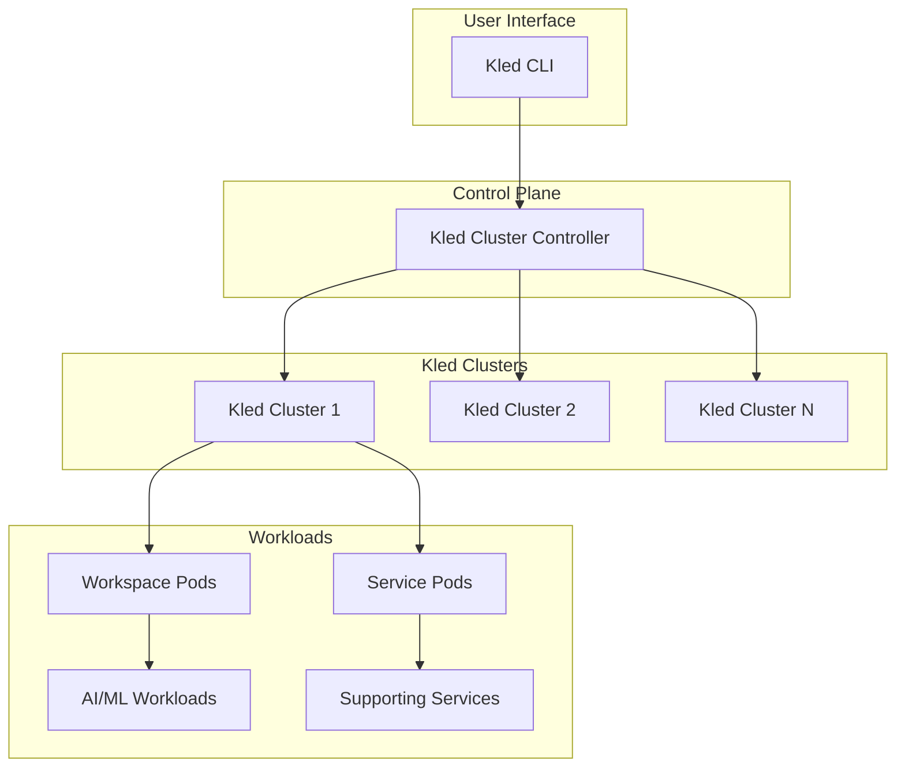

# Kled Cluster Integration

## Overview

The Kled Cluster Integration is a key component of the Kled.io Ecosystem, providing a secure and efficient environment for running AI/ML workloads. Kled Clusters are fully operable Kubernetes clusters running inside Physical Clusters, enabling enterprises to maximize the value of their infrastructure investments while ensuring the security and performance of their AI/ML applications.

## Architecture



The Kled Cluster Integration sits at the foundation of the Kled.io Ecosystem, providing a secure and efficient environment for running AI/ML workloads. This architecture enables multiple Kled Clusters to run on a single host cluster, each with its own isolated environment and resources.

## Key Components

### Kled Cluster Controller

The Kled Cluster Controller is responsible for managing the lifecycle of Kled Clusters, including creation, deletion, and updates. It ensures that each Kled Cluster has the necessary resources and configurations to operate effectively.

```go
// Kled Cluster Controller
type Controller struct {
    // Host cluster configuration
    HostConfig *config.HostConfig

    // Kled Cluster configurations
    KledClusters map[string]*config.KledClusterConfig

    // Kubernetes client
    Client kubernetes.Interface
}

// Create a new Kled Cluster
func (c *Controller) CreateKledCluster(name string, config *config.KledClusterConfig) error {
    // Create the Kled Cluster namespace
    namespace := &corev1.Namespace{
        ObjectMeta: metav1.ObjectMeta{
            Name: name,
        },
    }

    _, err := c.Client.CoreV1().Namespaces().Create(context.Background(), namespace, metav1.CreateOptions{})
    if err != nil {
        return err
    }

    // Create the Kled Cluster control plane
    controlPlane := &appsv1.StatefulSet{
        ObjectMeta: metav1.ObjectMeta{
            Name:      name + "-control-plane",
            Namespace: name,
        },
        Spec: appsv1.StatefulSetSpec{
            // Control plane configuration
        },
    }

    _, err = c.Client.AppsV1().StatefulSets(name).Create(context.Background(), controlPlane, metav1.CreateOptions{})
    if err != nil {
        return err
    }

    // Create the Kled Cluster service
    service := &corev1.Service{
        ObjectMeta: metav1.ObjectMeta{
            Name:      name + "-api",
            Namespace: name,
        },
        Spec: corev1.ServiceSpec{
            // Service configuration
        },
    }

    _, err = c.Client.CoreV1().Services(name).Create(context.Background(), service, metav1.CreateOptions{})
    if err != nil {
        return err
    }

    // Store the Kled Cluster configuration
    c.KledClusters[name] = config

    return nil
}
```

### Advanced Workspace Technology

The Kled.io Ecosystem features an advanced workspace technology that provides a comprehensive environment for development and deployment. This technology is built on several key components:

#### Custom Preload Image

The Kled.io Ecosystem includes a custom preload image that provides a comprehensive development environment with support for multiple languages and tools:

```dockerfile
FROM ubuntu:22.04

# Install common development tools
RUN apt-get update && apt-get install -y \
    build-essential \
    curl \
    git \
    python3 \
    python3-pip \
    nodejs \
    npm \
    golang \
    rustc \
    cargo \
    openjdk-17-jdk \
    maven \
    gradle \
    docker.io \
    kubectl \
    && rm -rf /var/lib/apt/lists/*

# Set up a non-root user
RUN useradd -m -s /bin/bash kled
RUN echo "kled ALL=(ALL) NOPASSWD:ALL" > /etc/sudoers.d/kled

# Set up Docker to run without sudo
RUN usermod -aG docker kled

# Set up workspace directory
WORKDIR /workspace
RUN chown kled:kled /workspace

USER kled

# Install language-specific tools
RUN pip3 install --user pipenv poetry
RUN npm install -g yarn pnpm
RUN cargo install cargo-watch cargo-edit

# Set up environment variables
ENV PATH="/home/kled/.local/bin:${PATH}"
ENV LANG=C.UTF-8
ENV LC_ALL=C.UTF-8

# Set up entrypoint
COPY entrypoint.sh /usr/local/bin/
RUN chmod +x /usr/local/bin/entrypoint.sh
ENTRYPOINT ["/usr/local/bin/entrypoint.sh"]
```

This custom preload image provides several key benefits:

- **Full Language Support**: The image includes support for multiple programming languages, including Python, Node.js, Go, Rust, and Java.
- **Sudoless Environment**: The image is configured to allow users to run commands without sudo, improving security and usability.
- **Docker Support**: The image includes Docker, enabling containerized development within the workspace.
- **Kubernetes Tools**: The image includes kubectl and other Kubernetes tools for managing clusters.

#### Workspace Providers

The Kled.io Ecosystem supports multiple workspace providers, enabling users to create workspaces in different environments:

- **Local Provider**: Create workspaces on the local machine for development and testing.
- **Kubernetes Provider**: Create workspaces in a Kubernetes cluster for production deployments.
- **Cloud Providers**: Create workspaces in cloud environments, including AWS, GCP, and Azure.

Each provider is implemented as a plugin, allowing for easy extension and customization:

```go
// Workspace Provider interface
type Provider interface {
    // Create a workspace
    CreateWorkspace(name string, config *WorkspaceConfig) error

    // Delete a workspace
    DeleteWorkspace(name string) error

    // Start a workspace
    StartWorkspace(name string) error

    // Stop a workspace
    StopWorkspace(name string) error

    // Get workspace status
    GetWorkspaceStatus(name string) (WorkspaceStatus, error)
}

// Local Provider implementation
type LocalProvider struct {
    // Local provider configuration
    Config *LocalProviderConfig
}

// Kubernetes Provider implementation
type KubernetesProvider struct {
    // Kubernetes provider configuration
    Config *KubernetesProviderConfig

    // Kubernetes client
    Client kubernetes.Interface
}

// AWS Provider implementation
type AWSProvider struct {
    // AWS provider configuration
    Config *AWSProviderConfig

    // AWS client
    Client *aws.Client
}
```

#### Workspace Agents

The Kled.io Ecosystem uses workspace agents to manage the lifecycle of workspaces. These agents are responsible for:

- **Workspace Creation**: Creating the workspace environment, including the container image and configuration.
- **Workspace Configuration**: Configuring the workspace with the necessary tools and settings.
- **Workspace Monitoring**: Monitoring the workspace for changes and updates.
- **Workspace Cleanup**: Cleaning up resources when the workspace is deleted.

The workspace agent is injected into the workspace during creation and runs as a sidecar container:

```yaml
apiVersion: v1
kind: Pod
metadata:
  name: workspace-pod
  namespace: workspace-namespace
spec:
  containers:
  - name: workspace
    image: kled/workspace:latest
    volumeMounts:
    - name: workspace-data
      mountPath: /workspace
  - name: agent
    image: kled/workspace-agent:latest
    volumeMounts:
    - name: workspace-data
      mountPath: /workspace
    - name: docker-socket
      mountPath: /var/run/docker.sock
  volumes:
  - name: workspace-data
    persistentVolumeClaim:
      claimName: workspace-data
  - name: docker-socket
    hostPath:
      path: /var/run/docker.sock
```

#### Monorepo Support

The Kled.io Ecosystem provides advanced support for monorepos, enabling users to manage multiple projects within a single repository:

- **Dockerized Monorepos**: The workspace technology supports dockerized monorepos, enabling each project to have its own container environment.
- **Project Discovery**: The workspace agent automatically discovers projects within the monorepo and configures them for development.
- **Dependency Management**: The workspace technology manages dependencies between projects, ensuring that changes in one project are reflected in dependent projects.
- **Build Optimization**: The workspace technology optimizes builds for monorepos, only rebuilding projects that have changed.

Example monorepo structure:

```
monorepo/
├── project-a/
│   ├── Dockerfile
│   ├── package.json
│   └── src/
├── project-b/
│   ├── Dockerfile
│   ├── package.json
│   └── src/
└── project-c/
    ├── Dockerfile
    ├── package.json
    └── src/
```

The workspace agent detects the Dockerfiles in each project and creates a container for each one, enabling isolated development environments within the monorepo.

### Hashicorp Cloud Platform Integration

The Kled.io Ecosystem includes comprehensive integration with the Hashicorp Cloud Platform (HCP), providing a robust foundation for infrastructure management, security, and automation:

#### Terraform Integration

The Kled.io Ecosystem integrates with Terraform for infrastructure as code, enabling users to define and provision infrastructure using a declarative configuration language:

```hcl
# Define a Kled Cluster
resource "kled_cluster" "example" {
  name = "example-cluster"
  size = "medium"

  # Configure the control plane
  control_plane {
    replicas = 3
    version  = "1.25.0"
  }

  # Configure node pools
  node_pool {
    name     = "default"
    size     = "medium"
    replicas = 3
    version  = "1.25.0"
  }
}

# Define a workspace in the Kled Cluster
resource "kled_workspace" "example" {
  name        = "example-workspace"
  cluster     = kled_cluster.example.name
  repository  = "https://github.com/user/repo"
  branch      = "main"

  # Configure the workspace
  config {
    cpu    = "2"
    memory = "4Gi"
    disk   = "20Gi"
  }
}
```

#### Vault Integration

The Kled.io Ecosystem integrates with Vault for secrets management, providing a secure way to store and access sensitive information:

```go
// Vault client configuration
type VaultConfig struct {
    // Vault address
    Address string

    // Vault token
    Token string

    // Vault namespace
    Namespace string
}

// Vault client
type VaultClient struct {
    // Vault client configuration
    Config *VaultConfig

    // Vault API client
    Client *vault.Client
}

// Get a secret from Vault
func (c *VaultClient) GetSecret(path string) (map[string]interface{}, error) {
    // Get the secret from Vault
    secret, err := c.Client.Logical().Read(path)
    if err != nil {
        return nil, err
    }

    // Return the secret data
    return secret.Data, nil
}

// Store a secret in Vault
func (c *VaultClient) StoreSecret(path string, data map[string]interface{}) error {
    // Store the secret in Vault
    _, err := c.Client.Logical().Write(path, data)
    return err
}
```

#### Consul Integration

The Kled.io Ecosystem integrates with Consul for service discovery and configuration management, enabling services to discover and connect with each other:

```go
// Consul client configuration
type ConsulConfig struct {
    // Consul address
    Address string

    // Consul token
    Token string

    // Consul datacenter
    Datacenter string
}

// Consul client
type ConsulClient struct {
    // Consul client configuration
    Config *ConsulConfig

    // Consul API client
    Client *consul.Client
}

// Register a service with Consul
func (c *ConsulClient) RegisterService(service *consul.AgentServiceRegistration) error {
    // Register the service with Consul
    return c.Client.Agent().ServiceRegister(service)
}

// Deregister a service from Consul
func (c *ConsulClient) DeregisterService(serviceID string) error {
    // Deregister the service from Consul
    return c.Client.Agent().ServiceDeregister(serviceID)
}
```

#### Additional Hashicorp Integrations

The Kled.io Ecosystem also integrates with other Hashicorp products:

- **Waypoint**: For application deployment and lifecycle management.
- **Packer**: For building machine images for multiple platforms.
- **Vagrant**: For development environment management.
- **Vault Radar**: For secrets detection and management.
- **Vault Secrets**: For secrets management and rotation.
- **Vault Dedicated**: For dedicated Vault instances.

These integrations provide a comprehensive platform for infrastructure management, security, and automation, enabling enterprises to build and deploy applications with confidence.

### Kledspace and kPolicy

The Kled.io Ecosystem includes two key components for development and policy management:

#### Kledspace

Kledspace is a powerful development environment for Kubernetes, enabling developers to build, test, and debug applications directly in Kubernetes:

```yaml
# Kledspace configuration
version: v1
name: my-app

# Development container configuration
dev:
  # Container image
  image: kled/dev:latest

  # Port forwarding
  ports:
    - 8080:8080
    - 9229:9229

  # File synchronization
  sync:
    - src: ./src
      dest: /app/src
    - src: ./package.json
      dest: /app/package.json

  # Commands
  commands:
    - name: dev
      command: npm run dev
    - name: test
      command: npm test
    - name: build
      command: npm run build
```

Kledspace provides several key features:

- **Hot Reloading**: Changes to the source code are automatically synchronized to the container and the application is reloaded.
- **Debugging**: Integrated debugging support for various languages and frameworks.
- **Port Forwarding**: Automatic port forwarding from the container to the local machine.
- **Resource Management**: Efficient management of container resources to optimize development.

#### kPolicy

kPolicy is a policy management system for Kubernetes, enabling administrators to define and enforce policies across clusters:

```yaml
# kPolicy configuration
apiVersion: policy.kled.io/v1
kind: Policy
metadata:
  name: resource-limits
spec:
  # Policy rules
  rules:
    - name: container-limits
      match:
        kinds:
          - Pod
      validate:
        message: "Container must have resource limits"
        pattern:
          spec:
            containers:
              - resources:
                  limits:
                    memory: "?*"
                    cpu: "?*"
```

kPolicy provides several key features:

- **Policy Enforcement**: Enforce policies across clusters to ensure compliance with security and operational requirements.
- **Policy Validation**: Validate resources against policies before they are created or updated.
- **Policy Reporting**: Generate reports on policy compliance and violations.
- **Policy Templates**: Reusable policy templates for common requirements.

## Benefits

### Resource Efficiency

The Kled Cluster Integration enables efficient resource utilization by allowing multiple Kled Clusters to share the same underlying infrastructure:

- **Shared Worker Nodes**: Kled Clusters share the same worker nodes, eliminating the need for dedicated nodes for each cluster.
- **Optimized Resource Allocation**: Resources can be allocated dynamically based on workload requirements, ensuring optimal utilization.
- **Reduced Management Overhead**: A single host cluster can manage multiple Kled Clusters, reducing operational complexity and cost.

### Isolation and Security

The Kled Cluster Integration provides strong isolation between different workloads, ensuring that each application has its own secure environment:

- **Namespace Isolation**: Each Kled Cluster has its own set of namespaces, preventing resource conflicts and ensuring isolation.
- **API Server Isolation**: Each Kled Cluster has its own API server, providing control plane isolation and preventing unauthorized access.
- **Resource Quotas**: Resource quotas can be applied at the Kled Cluster level, preventing resource exhaustion and ensuring fair allocation.

### Scalability

The Kled Cluster Integration enables seamless scaling of AI/ML workloads, allowing enterprises to adapt to changing requirements:

- **Horizontal Scaling**: Additional Kled Clusters can be created as needed to accommodate growing workloads.
- **Vertical Scaling**: Resources can be added to existing Kled Clusters to handle increased demand.
- **Auto-Scaling**: Kled Clusters can be configured to scale automatically based on workload metrics, ensuring optimal performance.

## Use Cases

### Development Environments

The Kled Cluster Integration provides isolated development environments for teams working on different projects:

```bash
# Create a development Kled Cluster
kled cluster create dev-cluster --size small

# Create a workspace for a project
kled workspace create project-a --repo https://github.com/org/project-a --cluster dev-cluster

# Deploy supporting services
kled service deploy redis --cluster dev-cluster
kled service deploy postgres --cluster dev-cluster
```

### Testing Environments

The Kled Cluster Integration provides isolated testing environments for validating applications before deployment:

```bash
# Create a testing Kled Cluster
kled cluster create test-cluster --size medium

# Create a workspace for testing
kled workspace create test-workspace --repo https://github.com/org/project --cluster test-cluster

# Run tests
kled workspace exec test-workspace -- npm test
```

### Production Environments

The Kled Cluster Integration provides secure and scalable production environments for running AI/ML workloads:

```bash
# Create a production Kled Cluster
kled cluster create prod-cluster --size large

# Deploy the application
kled app deploy --repo https://github.com/org/app --cluster prod-cluster

# Scale the application
kled app scale app-name --replicas 3 --cluster prod-cluster
```

## Conclusion

The Kled Cluster Integration is a fundamental component of the Kled.io Ecosystem, providing a secure and efficient environment for running AI/ML workloads. By leveraging Kled Clusters, the Kled.io Ecosystem enables enterprises to maximize the value of their infrastructure investments while ensuring the security and performance of their AI/ML applications.
