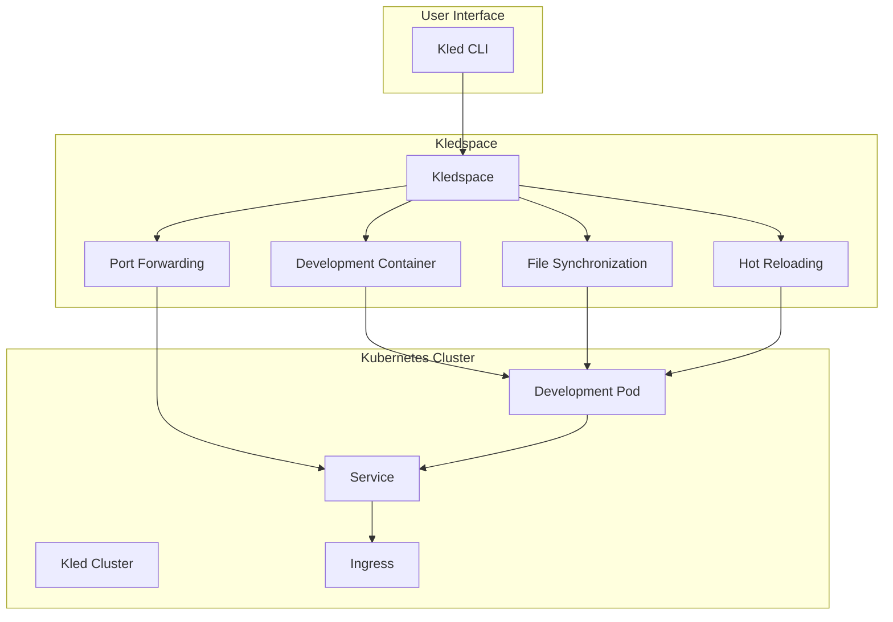

# Kledspace

Kledspace is a powerful development environment for Kubernetes, enabling developers to build, test, and debug applications directly in Kubernetes. This proprietary technology provides a seamless development experience for Kubernetes applications, making it easy to develop and deploy applications to Kubernetes clusters.

## Overview



Kledspace is designed to streamline the development workflow for Kubernetes applications, providing a seamless experience from development to deployment. By leveraging Kubernetes as the development environment, Kledspace ensures that applications behave the same way in development and production, reducing the likelihood of deployment issues.

## Key Features

### Development Container

Kledspace provides a development container that runs in a Kubernetes cluster, enabling developers to build, test, and debug applications directly in Kubernetes. The development container includes all the tools and dependencies needed for development, ensuring a consistent and reliable development experience.

Key features:
- **Custom Images**: Kledspace supports custom container images, enabling developers to use the tools and dependencies they need for their specific projects.
- **Environment Variables**: Kledspace allows developers to set environment variables for the development container, ensuring that the application has access to the configuration it needs.
- **Resource Limits**: Kledspace enables developers to set resource limits for the development container, ensuring that it has the resources it needs without impacting other applications in the cluster.
- **Volume Mounts**: Kledspace supports volume mounts, enabling developers to persist data between container restarts and share data between containers.

Example configuration:
```yaml
# Kledspace configuration
version: v1
name: my-app

# Development container configuration
dev:
  # Container image
  image: kled/dev:latest

  # Environment variables
  env:
    - name: NODE_ENV
      value: development
    - name: DEBUG
      value: "true"

  # Resource limits
  resources:
    limits:
      cpu: "1"
      memory: "2Gi"
    requests:
      cpu: "0.5"
      memory: "1Gi"

  # Volume mounts
  volumes:
    - name: data
      path: /app/data
```

### File Synchronization

Kledspace provides file synchronization between the local machine and the development container, enabling developers to edit files locally and see the changes reflected in the container in real-time. This feature ensures that developers can use their preferred tools and workflows while still benefiting from the Kubernetes development environment.

Key features:
- **Bidirectional Synchronization**: Kledspace supports bidirectional file synchronization, enabling developers to edit files either locally or in the container.
- **Selective Synchronization**: Kledspace allows developers to specify which files and directories to synchronize, ensuring that only the necessary files are transferred.
- **Ignore Patterns**: Kledspace supports ignore patterns, enabling developers to exclude files and directories from synchronization.
- **Initial Sync**: Kledspace performs an initial synchronization when the development container starts, ensuring that all files are up to date.

Example configuration:
```yaml
# Kledspace configuration
version: v1
name: my-app

# File synchronization configuration
sync:
  - src: ./src
    dest: /app/src
  - src: ./package.json
    dest: /app/package.json
  - src: ./tsconfig.json
    dest: /app/tsconfig.json

  # Ignore patterns
  excludePaths:
    - node_modules
    - .git
    - .vscode
    - dist
    - build
```

### Port Forwarding

Kledspace provides port forwarding between the local machine and the development container, enabling developers to access services running in the container from their local machine. This feature ensures that developers can test and debug applications as if they were running locally, while still benefiting from the Kubernetes development environment.

Key features:
- **Multiple Ports**: Kledspace supports forwarding multiple ports, enabling developers to access different services running in the container.
- **Custom Addresses**: Kledspace allows developers to specify the local address to bind to, enabling them to control how the forwarded ports are accessed.
- **Automatic Discovery**: Kledspace can automatically discover services in the Kubernetes cluster and forward their ports, simplifying the configuration process.
- **Reverse Forwarding**: Kledspace supports reverse port forwarding, enabling services in the container to access services on the local machine.

Example configuration:
```yaml
# Kledspace configuration
version: v1
name: my-app

# Port forwarding configuration
ports:
  - port: 8080:8080  # Local:Container
  - port: 9229:9229  # For debugging
  - port: 3000:3000  # For frontend
```

### Hot Reloading

Kledspace provides hot reloading for applications running in the development container, enabling developers to see the changes they make to the code reflected in the running application without having to restart the container. This feature ensures that developers can iterate quickly and efficiently, reducing the time and effort required to develop and test applications.

Key features:
- **Automatic Restart**: Kledspace can automatically restart the application when changes are detected, ensuring that the application is always running with the latest code.
- **Live Reload**: Kledspace supports live reload for web applications, enabling the browser to automatically refresh when changes are detected.
- **Selective Reloading**: Kledspace allows developers to specify which files and directories should trigger a reload, ensuring that only relevant changes cause a restart.
- **Custom Commands**: Kledspace supports custom commands for reloading, enabling developers to use the tools and workflows that best suit their projects.

Example configuration:
```yaml
# Kledspace configuration
version: v1
name: my-app

# Hot reloading configuration
dev:
  # Commands to run in the container
  command:
    - npm
    - run
    - dev

  # Files to watch for changes
  watch:
    - src/**/*
    - package.json
    - tsconfig.json

  # Command to run when changes are detected
  restart:
    command:
      - npm
      - run
      - dev
```

### Debugging

Kledspace provides comprehensive debugging capabilities for applications running in the development container, enabling developers to debug applications directly in Kubernetes. This feature ensures that developers can identify and fix issues quickly and efficiently, reducing the time and effort required to develop and test applications.

Key features:
- **Remote Debugging**: Kledspace supports remote debugging for various languages and frameworks, enabling developers to debug applications running in the container from their local machine.
- **Debug Configurations**: Kledspace provides pre-configured debug configurations for popular languages and frameworks, simplifying the setup process.
- **Breakpoints**: Kledspace supports breakpoints, enabling developers to pause the execution of the application at specific points and inspect the state.
- **Variable Inspection**: Kledspace allows developers to inspect variables and their values during debugging, providing insights into the application's behavior.

Example configuration:
```yaml
# Kledspace configuration
version: v1
name: my-app

# Debugging configuration
dev:
  # Port forwarding for debugging
  ports:
    - port: 9229:9229  # For Node.js debugging

  # Command to run with debugging enabled
  command:
    - node
    - --inspect=0.0.0.0:9229
    - app.js
```

## Integration with Kled Clusters

Kledspace integrates seamlessly with Kled Clusters, enabling developers to create development environments in Kled Clusters and deploy applications to them. This integration ensures that developers can leverage the security and efficiency of Kled Clusters while still benefiting from the powerful development capabilities of Kledspace.

Key features:
- **Cluster Selection**: Kledspace allows developers to select which Kled Cluster to use for development, enabling them to choose the environment that best suits their needs.
- **Namespace Isolation**: Kledspace creates isolated namespaces in the Kled Cluster for each development environment, ensuring that different environments do not interfere with each other.
- **Resource Quotas**: Kledspace respects the resource quotas of the Kled Cluster, ensuring that development environments do not consume excessive resources.
- **Security Policies**: Kledspace adheres to the security policies of the Kled Cluster, ensuring that development environments are secure and compliant.

Example configuration:
```yaml
# Kledspace configuration
version: v1
name: my-app

# Kled Cluster configuration
cluster:
  name: dev-cluster
  namespace: my-app-dev

# Development container configuration
dev:
  # Container image
  image: kled/dev:latest

  # Resource limits
  resources:
    limits:
      cpu: "1"
      memory: "2Gi"
    requests:
      cpu: "0.5"
      memory: "1Gi"
```

## Example Configurations

### JavaScript Application

```yaml
# Kledspace configuration for a JavaScript application
version: v1
name: js-app

# Development container configuration
dev:
  # Container image
  image: node:16

  # Port forwarding
  ports:
    - port: 3000:3000  # For the application
    - port: 9229:9229  # For debugging

  # File synchronization
  sync:
    - src: ./src
      dest: /app/src
    - src: ./package.json
      dest: /app/package.json
    - src: ./tsconfig.json
      dest: /app/tsconfig.json

  # Commands to run in the container
  command:
    - npm
    - run
    - dev

  # Environment variables
  env:
    - name: NODE_ENV
      value: development
    - name: DEBUG
      value: "true"
```

### Python Application

```yaml
# Kledspace configuration for a Python application
version: v1
name: python-app

# Development container configuration
dev:
  # Container image
  image: python:3.9

  # Port forwarding
  ports:
    - port: 8000:8000  # For the application
    - port: 5678:5678  # For debugging

  # File synchronization
  sync:
    - src: ./src
      dest: /app/src
    - src: ./requirements.txt
      dest: /app/requirements.txt
    - src: ./setup.py
      dest: /app/setup.py

  # Commands to run in the container
  command:
    - python
    - -m
    - uvicorn
    - src.main:app
    - --reload
    - --host
    - 0.0.0.0
    - --port
    - "8000"

  # Environment variables
  env:
    - name: PYTHONPATH
      value: /app
    - name: DEBUG
      value: "true"
```

### Ruby Application

```yaml
# Kledspace configuration for a Ruby application
version: v1
name: ruby-app

# Development container configuration
dev:
  # Container image
  image: ruby:3.0

  # Port forwarding
  ports:
    - port: 3000:3000  # For the application
    - port: 1234:1234  # For debugging

  # File synchronization
  sync:
    - src: ./app
      dest: /app/app
    - src: ./config
      dest: /app/config
    - src: ./Gemfile
      dest: /app/Gemfile
    - src: ./Gemfile.lock
      dest: /app/Gemfile.lock

  # Commands to run in the container
  command:
    - bundle
    - exec
    - rails
    - server
    - -b
    - 0.0.0.0

  # Environment variables
  env:
    - name: RAILS_ENV
      value: development
    - name: DEBUG
      value: "true"
```

## Benefits

### Consistent Development Environment

Kledspace provides a consistent development environment across different machines and platforms, ensuring that applications behave the same way in development and production. This consistency reduces the likelihood of "works on my machine" issues and simplifies the deployment process.

Key benefits:
- **Reduced Environment Discrepancies**: By using the same container image for development and production, Kledspace ensures that the application runs in the same environment throughout the development lifecycle.
- **Simplified Onboarding**: New team members can quickly set up a development environment that matches the rest of the team, reducing onboarding time and complexity.
- **Improved Collaboration**: Team members can share development environments and collaborate on projects, knowing that they are working in the same environment.
- **Streamlined CI/CD**: The consistency between development and production environments simplifies continuous integration and continuous deployment, reducing the likelihood of deployment issues.

### Efficient Development Workflow

Kledspace provides an efficient development workflow for Kubernetes applications, enabling developers to iterate quickly and efficiently. This efficiency reduces the time and effort required to develop and test applications, increasing developer productivity.

Key benefits:
- **Fast Iteration**: With features like file synchronization and hot reloading, Kledspace enables developers to see the changes they make to the code reflected in the running application almost instantly.
- **Simplified Debugging**: Kledspace's debugging capabilities enable developers to identify and fix issues quickly and efficiently, reducing the time spent on debugging.
- **Streamlined Deployment**: Kledspace's integration with Kled Clusters simplifies the deployment process, enabling developers to deploy applications to production with confidence.
- **Reduced Context Switching**: By providing a comprehensive development environment, Kledspace reduces the need for developers to switch between different tools and environments, increasing focus and productivity.

### Enhanced Collaboration

Kledspace enhances collaboration among team members, enabling them to work together on projects more effectively. This collaboration improves the quality of the code and reduces the time required to develop and deploy applications.

Key benefits:
- **Shared Development Environments**: Team members can share development environments, ensuring that everyone is working in the same environment and reducing the likelihood of environment-related issues.
- **Consistent Tooling**: Kledspace ensures that all team members use the same tools and workflows, reducing confusion and improving collaboration.
- **Simplified Knowledge Sharing**: With a consistent development environment, it's easier for team members to share knowledge and help each other, improving the overall team productivity.
- **Improved Code Quality**: By enabling team members to collaborate more effectively, Kledspace helps improve the quality of the code, reducing the likelihood of bugs and issues.

## Conclusion

Kledspace is a powerful development environment for Kubernetes, enabling developers to build, test, and debug applications directly in Kubernetes. By providing a seamless development experience for Kubernetes applications, Kledspace makes it easy to develop and deploy applications to Kubernetes clusters, improving developer productivity and code quality.

With features like development containers, file synchronization, port forwarding, hot reloading, and debugging, Kledspace provides a comprehensive solution for Kubernetes development. Its integration with Kled Clusters ensures that developers can leverage the security and efficiency of Kled Clusters while still benefiting from the powerful development capabilities of Kledspace.
