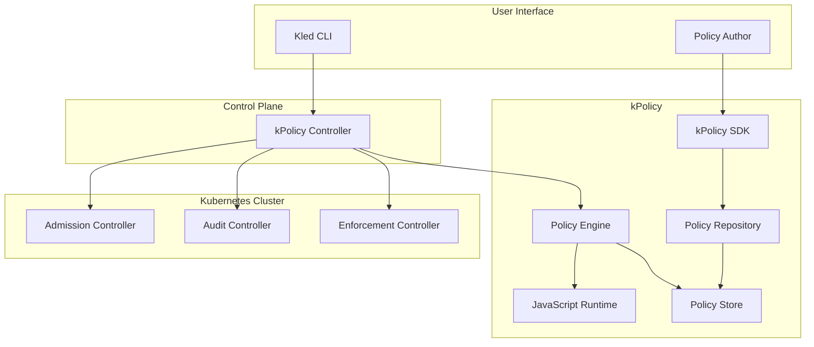

# kPolicy

kPolicy is a powerful policy management system for Kubernetes that enables administrators to define and enforce policies across clusters using JavaScript. This proprietary technology provides a flexible and intuitive way to implement security, compliance, and operational policies in Kubernetes environments.

## Overview



kPolicy is designed to provide a comprehensive policy management solution for Kubernetes, enabling administrators to define, enforce, and audit policies across clusters. By leveraging JavaScript as the policy language, kPolicy makes it easy for administrators to write and maintain policies, while still providing the flexibility and power needed to address complex policy requirements.

## Key Features

### JavaScript-Based Policies

kPolicy uses JavaScript as the policy language, providing a familiar and powerful way to define policies:

```javascript
// Example policy: Require resource limits for all containers
export default function(request) {
  // Skip if not a Pod
  if (request.kind.kind !== "Pod") {
    return true;
  }

  // Check each container for resource limits
  const containers = request.object.spec.containers || [];
  for (const container of containers) {
    if (!container.resources || !container.resources.limits) {
      return {
        allowed: false,
        message: `Container ${container.name} must have resource limits defined`
      };
    }

    // Check for memory and CPU limits
    const limits = container.resources.limits;
    if (!limits.memory || !limits.cpu) {
      return {
        allowed: false,
        message: `Container ${container.name} must have memory and CPU limits defined`
      };
    }
  }

  // All containers have resource limits
  return true;
}
```

Key benefits of JavaScript-based policies:

- **Familiar Language**: JavaScript is widely known, making it easy for administrators to write and understand policies.
- **Expressive Power**: JavaScript provides the expressive power needed to implement complex policies.
- **Rich Ecosystem**: The JavaScript ecosystem provides a wealth of libraries and tools for policy development.
- **Easy Integration**: JavaScript policies can easily integrate with external systems and APIs.

### Policy Types

kPolicy supports multiple policy types, enabling administrators to address different policy requirements:

#### Validation Policies

Validation policies ensure that resources meet specific requirements before they are created or updated:

```javascript
// Example validation policy: Require labels for all resources
export default function(request) {
  // Check for required labels
  const requiredLabels = ["app", "environment", "team"];
  const labels = request.object.metadata.labels || {};

  // Check each required label
  for (const label of requiredLabels) {
    if (!labels[label]) {
      return {
        allowed: false,
        message: `Resource must have label: ${label}`
      };
    }
  }

  // All required labels are present
  return true;
}
```

#### Mutation Policies

Mutation policies modify resources before they are created or updated, ensuring that they meet specific requirements:

```javascript
// Example mutation policy: Add default labels to all resources
export default function(request) {
  // Get the resource
  const resource = request.object;

  // Ensure labels exist
  if (!resource.metadata.labels) {
    resource.metadata.labels = {};
  }

  // Add default labels
  resource.metadata.labels["managed-by"] = "kpolicy";
  resource.metadata.labels["created-at"] = new Date().toISOString();

  // Return the modified resource
  return {
    allowed: true,
    patchType: "JSONPatch",
    patch: [
      {
        op: "add",
        path: "/metadata/labels/managed-by",
        value: "kpolicy"
      },
      {
        op: "add",
        path: "/metadata/labels/created-at",
        value: new Date().toISOString()
      }
    ]
  };
}
```

#### Audit Policies

Audit policies check existing resources for compliance with policies, enabling administrators to identify and remediate non-compliant resources:

```javascript
// Example audit policy: Check for deprecated API versions
export default function(request) {
  // Check for deprecated API versions
  const deprecatedVersions = {
    "apps/v1beta1": "apps/v1",
    "apps/v1beta2": "apps/v1",
    "extensions/v1beta1": "apps/v1"
  };

  // Check if the resource uses a deprecated API version
  const apiVersion = request.object.apiVersion;
  if (deprecatedVersions[apiVersion]) {
    return {
      compliant: false,
      message: `Resource uses deprecated API version: ${apiVersion}. Use ${deprecatedVersions[apiVersion]} instead.`
    };
  }

  // Resource uses a supported API version
  return {
    compliant: true
  };
}
```

### Policy SDK

kPolicy provides a comprehensive SDK for policy development, enabling administrators to write, test, and deploy policies with ease:

```javascript
// Example policy using the SDK
import { Policy, ValidationPolicy } from "@kled/kpolicy-sdk";

// Define a validation policy
@Policy({
  name: "require-resource-limits",
  description: "Require resource limits for all containers",
  resources: ["Pod"]
})
export default class RequireResourceLimits extends ValidationPolicy {
  validate(request) {
    // Check each container for resource limits
    const containers = request.object.spec.containers || [];
    for (const container of containers) {
      if (!container.resources || !container.resources.limits) {
        return this.deny(`Container ${container.name} must have resource limits defined`);
      }

      // Check for memory and CPU limits
      const limits = container.resources.limits;
      if (!limits.memory || !limits.cpu) {
        return this.deny(`Container ${container.name} must have memory and CPU limits defined`);
      }
    }

    // All containers have resource limits
    return this.allow();
  }
}
```

The SDK provides several key features:

- **Policy Classes**: Pre-defined classes for different policy types, making it easy to implement common policy patterns.
- **Testing Utilities**: Tools for testing policies, ensuring that they work as expected before deployment.
- **Deployment Tools**: Tools for deploying policies to Kubernetes clusters, simplifying the policy lifecycle.
- **Documentation Generation**: Tools for generating documentation from policies, making it easy to understand and maintain policies.

### Policy Repository

kPolicy includes a policy repository for storing and managing policies, enabling administrators to organize and version policies:

```yaml
# Example policy repository configuration
apiVersion: kpolicy.kled.io/v1
kind: PolicyRepository
metadata:
  name: organization-policies
spec:
  # Repository URL
  url: https://github.com/organization/policies

  # Branch to use
  branch: main

  # Authentication
  auth:
    # SSH key for authentication
    sshKey:
      secretName: github-ssh-key
      secretKey: id_rsa

  # Sync configuration
  sync:
    # Sync interval
    interval: 5m

    # Sync timeout
    timeout: 1m

    # Retry configuration
    retry:
      # Number of retries
      count: 3

      # Retry interval
      interval: 1m
```

The policy repository provides several key features:

- **Version Control**: Policies are stored in a version control system, enabling administrators to track changes and roll back if needed.
- **Collaboration**: Multiple administrators can collaborate on policies, using standard version control workflows.
- **CI/CD Integration**: The policy repository can be integrated with CI/CD pipelines, enabling automated testing and deployment of policies.
- **Policy Reuse**: Policies can be shared across clusters, ensuring consistent policy enforcement.

### Policy Enforcement

kPolicy provides comprehensive policy enforcement capabilities, ensuring that policies are applied consistently across clusters:

```yaml
# Example policy enforcement configuration
apiVersion: kpolicy.kled.io/v1
kind: PolicyEnforcement
metadata:
  name: organization-enforcement
spec:
  # Policies to enforce
  policies:
    - name: require-resource-limits
      enforcement: deny
    - name: require-labels
      enforcement: deny
    - name: add-default-labels
      enforcement: mutate
    - name: check-deprecated-api-versions
      enforcement: audit

  # Enforcement scope
  scope:
    # Namespaces to include
    namespaces:
      - default
      - kube-system
      - kube-public

    # Resources to include
    resources:
      - pods
      - deployments
      - services

    # Exclude system resources
    excludeSystemResources: true
```

Policy enforcement provides several key features:

- **Flexible Enforcement**: Policies can be enforced in different ways, including validation, mutation, and audit.
- **Scoped Enforcement**: Policies can be applied to specific namespaces, resources, and resource types.
- **Exemptions**: Resources can be exempted from policy enforcement, enabling administrators to handle special cases.
- **Dry Run**: Policies can be applied in dry run mode, enabling administrators to test policies before enforcing them.

### Integration with Kled Clusters

kPolicy integrates seamlessly with Kled Clusters, enabling administrators to define and enforce policies across clusters:

```yaml
# Example Kled Cluster policy configuration
apiVersion: kled.io/v1
kind: KledCluster
metadata:
  name: production-cluster
spec:
  # Cluster configuration
  # ...

  # Policy configuration
  policies:
    # Policy repository
    repository:
      name: organization-policies

    # Policy enforcement
    enforcement:
      name: organization-enforcement
```

This integration provides several key benefits:

- **Centralized Policy Management**: Policies can be managed centrally and applied consistently across clusters.
- **Cluster-Specific Policies**: Clusters can have their own policies, addressing specific requirements.
- **Policy Inheritance**: Clusters can inherit policies from parent clusters, ensuring consistent policy enforcement.
- **Policy Overrides**: Clusters can override policies from parent clusters, enabling flexibility while maintaining consistency.

## Example Policies

### Security Policies

kPolicy enables administrators to implement comprehensive security policies, ensuring that resources meet security requirements:

```javascript
// Example security policy: Require secure pod configuration
export default function(request) {
  // Skip if not a Pod
  if (request.kind.kind !== "Pod") {
    return true;
  }

  // Get the pod
  const pod = request.object;

  // Check for privileged containers
  const containers = pod.spec.containers || [];
  for (const container of containers) {
    if (container.securityContext && container.securityContext.privileged) {
      return {
        allowed: false,
        message: `Container ${container.name} must not be privileged`
      };
    }
  }

  // Check for host network
  if (pod.spec.hostNetwork) {
    return {
      allowed: false,
      message: "Pod must not use host network"
    };
  }

  // Check for host PID
  if (pod.spec.hostPID) {
    return {
      allowed: false,
      message: "Pod must not use host PID"
    };
  }

  // Check for host IPC
  if (pod.spec.hostIPC) {
    return {
      allowed: false,
      message: "Pod must not use host IPC"
    };
  }

  // Pod meets security requirements
  return true;
}
```

### Compliance Policies

kPolicy enables administrators to implement compliance policies, ensuring that resources meet regulatory requirements:

```javascript
// Example compliance policy: Require data classification labels
export default function(request) {
  // Get the resource
  const resource = request.object;

  // Get the labels
  const labels = resource.metadata.labels || {};

  // Check for data classification label
  if (!labels["data-classification"]) {
    return {
      allowed: false,
      message: "Resource must have a data-classification label"
    };
  }

  // Check for valid data classification
  const validClassifications = ["public", "internal", "confidential", "restricted"];
  if (!validClassifications.includes(labels["data-classification"])) {
    return {
      allowed: false,
      message: `Invalid data classification: ${labels["data-classification"]}. Must be one of: ${validClassifications.join(", ")}`
    };
  }

  // Resource meets compliance requirements
  return true;
}
```

### Operational Policies

kPolicy enables administrators to implement operational policies, ensuring that resources meet operational requirements:

```javascript
// Example operational policy: Require resource quotas for namespaces
export default function(request) {
  // Skip if not a Namespace
  if (request.kind.kind !== "Namespace") {
    return true;
  }

  // Get the namespace
  const namespace = request.object;

  // Check if the namespace has a resource quota
  const resourceQuotas = request.related.ResourceQuota || [];
  if (resourceQuotas.length === 0) {
    return {
      allowed: false,
      message: "Namespace must have a resource quota"
    };
  }

  // Namespace meets operational requirements
  return true;
}
```

## Benefits

### Enhanced Security

kPolicy enhances security by enabling administrators to define and enforce security policies across clusters:

- **Consistent Security Policies**: Security policies are applied consistently across clusters, reducing the risk of security vulnerabilities.
- **Automated Security Checks**: Security checks are automated, ensuring that all resources meet security requirements.
- **Comprehensive Security Coverage**: Security policies can address a wide range of security concerns, from container security to network security.
- **Proactive Security**: Security policies are enforced before resources are created or updated, preventing security issues before they occur.

### Simplified Compliance

kPolicy simplifies compliance by enabling administrators to define and enforce compliance policies across clusters:

- **Regulatory Compliance**: Compliance policies can address regulatory requirements, such as GDPR, HIPAA, and PCI DSS.
- **Industry Standards**: Compliance policies can address industry standards, such as CIS Kubernetes Benchmarks and NIST Cybersecurity Framework.
- **Organizational Policies**: Compliance policies can address organizational policies, such as data classification and access control.
- **Compliance Reporting**: Compliance reports can be generated from policy audit results, providing visibility into compliance status.

### Operational Efficiency

kPolicy improves operational efficiency by enabling administrators to define and enforce operational policies across clusters:

- **Standardized Configurations**: Operational policies ensure that resources are configured consistently, reducing the risk of configuration errors.
- **Automated Remediation**: Operational policies can automatically remediate non-compliant resources, reducing the need for manual intervention.
- **Resource Optimization**: Operational policies can ensure that resources are optimized for performance and cost, improving overall efficiency.
- **Reduced Management Overhead**: Centralized policy management reduces the overhead of managing policies across clusters.

## Use Cases

### Multi-Cluster Policy Management

kPolicy enables administrators to manage policies across multiple clusters, ensuring consistent policy enforcement:

```bash
# Create a policy repository
kled policy repository create organization-policies --url https://github.com/organization/policies --branch main

# Create a policy enforcement configuration
kled policy enforcement create organization-enforcement --policies require-resource-limits,require-labels,add-default-labels

# Apply the policy enforcement configuration to a cluster
kled cluster update production-cluster --policies.enforcement organization-enforcement
```

### Compliance Auditing

kPolicy enables administrators to audit clusters for compliance with policies, identifying and remediating non-compliant resources:

```bash
# Run a compliance audit
kled policy audit run --cluster production-cluster --policies require-resource-limits,require-labels

# View audit results
kled policy audit results --cluster production-cluster

# Remediate non-compliant resources
kled policy audit remediate --cluster production-cluster --policies require-resource-limits,require-labels
```

### Policy Development and Testing

kPolicy enables administrators to develop and test policies before deploying them to clusters:

```bash
# Create a new policy
kled policy create require-resource-limits --type validation

# Test the policy
kled policy test require-resource-limits --resource pod.yaml

# Deploy the policy
kled policy deploy require-resource-limits --cluster production-cluster
```

## Conclusion

kPolicy is a powerful policy management system for Kubernetes that enables administrators to define and enforce policies across clusters using JavaScript. By providing a flexible and intuitive way to implement security, compliance, and operational policies, kPolicy helps enterprises ensure the security, compliance, and operational efficiency of their Kubernetes environments.
