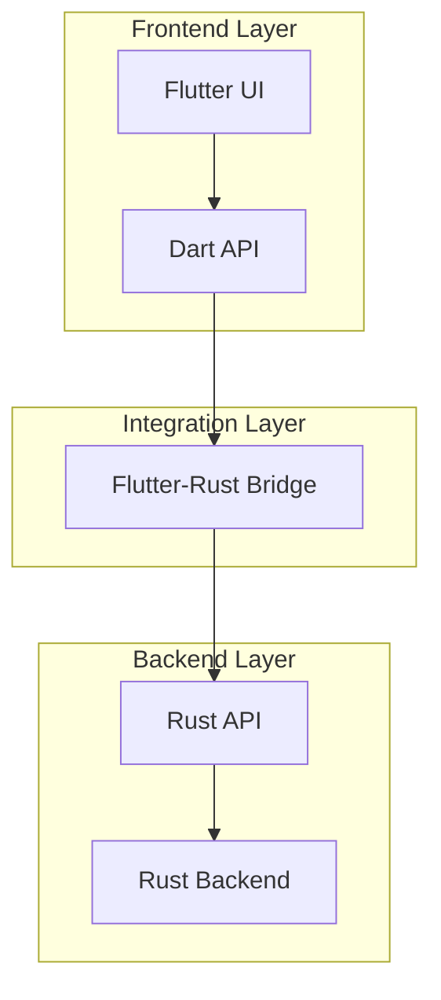

# Rust-to-Flutter Bridge

## Overview

The Rust-to-Flutter Bridge is a critical component of the Kled.io Ecosystem, enabling seamless integration between the Rust backend and Flutter frontend. This bridge allows for efficient data exchange and function calls between the two environments, providing the performance and security benefits of Rust with the cross-platform UI capabilities of Flutter.

## Architecture



The Rust-to-Flutter Bridge sits between the Flutter UI and the Rust backend, providing a seamless interface for communication between the two environments. This architecture enables the Flutter UI to leverage the performance and security benefits of Rust while maintaining the cross-platform capabilities of Flutter.

## Key Components

### Flutter-Rust Bridge

The Flutter-Rust Bridge is a code generation tool that creates the necessary bindings between Rust and Dart, enabling seamless communication between the two languages:

```rust
#[flutter_rust_bridge::frb(sync)]
pub fn greet(name: String) -> String {
    format!("Hello, {name}!")
}

#[flutter_rust_bridge::frb(init)]
pub fn init_app() {
    // Default utilities - feel free to customize
    flutter_rust_bridge::setup_default_user_utils();
}
```

### Dart API

The Dart API provides a type-safe interface for the Flutter UI to interact with the Rust backend:

```dart
import 'package:flutter/material.dart';
import 'package:flutter_rust_bridge/flutter_rust_bridge.dart';
import 'package:kled_app/bridge_generated.dart';

class RustBridgeExample extends StatefulWidget {
  const RustBridgeExample({Key? key}) : super(key: key);

  @override
  State<RustBridgeExample> createState() => _RustBridgeExampleState();
}

class _RustBridgeExampleState extends State<RustBridgeExample> {
  final api = RustAPI();
  String _greeting = '';

  @override
  void initState() {
    super.initState();
    _loadGreeting();
  }

  Future<void> _loadGreeting() async {
    final greeting = await api.greet(name: 'Flutter');
    setState(() {
      _greeting = greeting;
    });
  }

  @override
  Widget build(BuildContext context) {
    return Scaffold(
      appBar: AppBar(
        title: const Text('Flutter-Rust Bridge Example'),
      ),
      body: Center(
        child: Text(
          _greeting,
          style: const TextStyle(fontSize: 24),
        ),
      ),
    );
  }
}
```

### Rust API

The Rust API provides the implementation of the functions that are exposed to the Flutter UI:

```rust
/// API for the Flutter UI
pub struct RustAPI {
    /// Backend client
    client: BackendClient,
}

impl RustAPI {
    /// Create a new API instance
    pub fn new() -> Self {
        Self {
            client: BackendClient::new(),
        }
    }

    /// Get a greeting
    pub fn greet(&self, name: String) -> String {
        format!("Hello, {}!", name)
    }

    /// List workspaces
    pub async fn list_workspaces(&self) -> Result<Vec<Workspace>> {
        self.client.list_workspaces().await
    }

    /// Create a workspace
    pub async fn create_workspace(&self, name: String, repo: String, cluster: String) -> Result<Workspace> {
        self.client.create_workspace(name, repo, cluster).await
    }

    /// Delete a workspace
    pub async fn delete_workspace(&self, id: String) -> Result<()> {
        self.client.delete_workspace(id).await
    }
}
```

## Implementation Details

### Code Generation

The Flutter-Rust Bridge uses code generation to create the necessary bindings between Rust and Dart:

```bash
# Generate the bindings
flutter_rust_bridge_codegen \
    --rust-input src/api.rs \
    --dart-output lib/bridge_generated.dart \
    --c-output ios/Runner/bridge_generated.h \
    --extra-c-output-path macos/Runner/ \
    --dart-decl-output lib/bridge_definitions.dart
```

The generated code provides a type-safe interface for the Flutter UI to interact with the Rust backend:

```dart
// Generated Dart code
class RustAPI {
  Future<String> greet({required String name}) {
    return executeNormal(FlutterRustBridgeTask(
      callFfi: (port_) => ffi.wire_greet(port_, _api.toWire(name)),
      parseSuccessData: _api.parseSuccessData,
      parseErrorData: _api.parseErrorData,
    ));
  }

  Future<List<Workspace>> listWorkspaces() {
    return executeNormal(FlutterRustBridgeTask(
      callFfi: (port_) => ffi.wire_list_workspaces(port_),
      parseSuccessData: (data) => _api.parseList<Workspace>(data, (item) => _api.parseWorkspace(item)),
      parseErrorData: _api.parseErrorData,
    ));
  }

  Future<Workspace> createWorkspace({required String name, required String repo, required String cluster}) {
    return executeNormal(FlutterRustBridgeTask(
      callFfi: (port_) => ffi.wire_create_workspace(port_, _api.toWire(name), _api.toWire(repo), _api.toWire(cluster)),
      parseSuccessData: (data) => _api.parseWorkspace(data),
      parseErrorData: _api.parseErrorData,
    ));
  }

  Future<void> deleteWorkspace({required String id}) {
    return executeNormal(FlutterRustBridgeTask(
      callFfi: (port_) => ffi.wire_delete_workspace(port_, _api.toWire(id)),
      parseSuccessData: (_) => null,
      parseErrorData: _api.parseErrorData,
    ));
  }
}
```

### Data Serialization

The Flutter-Rust Bridge handles data serialization between Rust and Dart, ensuring that data is correctly converted between the two languages:

```rust
/// Workspace data
#[derive(Debug, Clone, Serialize, Deserialize)]
pub struct Workspace {
    /// Workspace ID
    pub id: String,
    /// Workspace name
    pub name: String,
    /// Repository URL
    pub repo: String,
    /// Virtual cluster
    pub cluster: String,
    /// Workspace status
    pub status: WorkspaceStatus,
}

/// Workspace status
#[derive(Debug, Clone, Serialize, Deserialize)]
pub enum WorkspaceStatus {
    /// Creating
    Creating,
    /// Running
    Running,
    /// Stopped
    Stopped,
    /// Failed
    Failed,
}
```

The generated code provides the necessary serialization and deserialization functions:

```dart
// Generated Dart code
class Workspace {
  final String id;
  final String name;
  final String repo;
  final String cluster;
  final WorkspaceStatus status;

  Workspace({
    required this.id,
    required this.name,
    required this.repo,
    required this.cluster,
    required this.status,
  });
}

enum WorkspaceStatus {
  creating,
  running,
  stopped,
  failed,
}
```

### Error Handling

The Flutter-Rust Bridge provides comprehensive error handling, ensuring that errors in the Rust backend are properly propagated to the Flutter UI:

```rust
/// Error type
#[derive(Debug, Clone, Serialize, Deserialize)]
pub enum Error {
    /// Not found
    NotFound,
    /// Invalid input
    InvalidInput(String),
    /// Internal error
    Internal(String),
}

impl From<Error> for String {
    fn from(error: Error) -> Self {
        match error {
            Error::NotFound => "Not found".to_string(),
            Error::InvalidInput(message) => format!("Invalid input: {}", message),
            Error::Internal(message) => format!("Internal error: {}", message),
        }
    }
}
```

The generated code provides the necessary error handling functions:

```dart
// Generated Dart code
class RustError {
  final String message;

  RustError(this.message);

  @override
  String toString() => message;
}
```

## Benefits

### Performance

The Rust-to-Flutter Bridge provides exceptional performance, with low latency and high throughput:

- **Zero-Copy Data Transfer**: The bridge minimizes data copying, reducing CPU and memory overhead.
- **Efficient Memory Management**: Rust's ownership model ensures efficient memory usage without the overhead of garbage collection.
- **Optimized Protocol**: The communication protocol is designed for efficiency, minimizing overhead and maximizing throughput.

### Type Safety

The Rust-to-Flutter Bridge provides strong type safety, ensuring that data is correctly converted between Rust and Dart:

- **Compile-Time Type Checking**: The bridge performs compile-time type checking, catching many potential errors before they occur.
- **Runtime Type Validation**: The bridge validates types at runtime, ensuring that data is correctly converted between Rust and Dart.
- **Error Propagation**: The bridge properly propagates errors from Rust to Dart, ensuring that errors are handled correctly.

### Developer Experience

The Rust-to-Flutter Bridge enhances the developer experience, making it easier to build cross-platform applications with Rust and Flutter:

- **Code Generation**: The bridge generates the necessary bindings between Rust and Dart, reducing boilerplate code.
- **Type-Safe API**: The bridge provides a type-safe API for the Flutter UI to interact with the Rust backend.
- **Comprehensive Documentation**: The bridge provides comprehensive documentation, making it easier to understand and use.

## Integration with Other Components

### Flutter UI Integration

The Rust-to-Flutter Bridge integrates with the Flutter UI through the generated Dart API:

```dart
import 'package:flutter/material.dart';
import 'package:kled_app/bridge_generated.dart';

class WorkspaceList extends StatefulWidget {
  const WorkspaceList({Key? key}) : super(key: key);

  @override
  State<WorkspaceList> createState() => _WorkspaceListState();
}

class _WorkspaceListState extends State<WorkspaceList> {
  final api = RustAPI();
  List<Workspace> _workspaces = [];
  bool _loading = true;
  String? _error;

  @override
  void initState() {
    super.initState();
    _loadWorkspaces();
  }

  Future<void> _loadWorkspaces() async {
    try {
      final workspaces = await api.listWorkspaces();
      setState(() {
        _workspaces = workspaces;
        _loading = false;
        _error = null;
      });
    } catch (e) {
      setState(() {
        _loading = false;
        _error = e.toString();
      });
    }
  }

  @override
  Widget build(BuildContext context) {
    if (_loading) {
      return const Center(
        child: CircularProgressIndicator(),
      );
    }

    if (_error != null) {
      return Center(
        child: Text(
          'Error: $_error',
          style: const TextStyle(color: Colors.red),
        ),
      );
    }

    if (_workspaces.isEmpty) {
      return const Center(
        child: Text('No workspaces found'),
      );
    }

    return ListView.builder(
      itemCount: _workspaces.length,
      itemBuilder: (context, index) {
        final workspace = _workspaces[index];
        return ListTile(
          title: Text(workspace.name),
          subtitle: Text(workspace.repo),
          trailing: Text(workspace.status.toString()),
          onTap: () {
            // Navigate to workspace details
          },
        );
      },
    );
  }
}
```

### Rust Backend Integration

The Rust-to-Flutter Bridge integrates with the Rust backend through the Rust API:

```rust
/// Backend client
pub struct BackendClient {
    /// HTTP client
    client: reqwest::Client,
    /// Base URL
    base_url: String,
}

impl BackendClient {
    /// Create a new backend client
    pub fn new() -> Self {
        Self {
            client: reqwest::Client::new(),
            base_url: "http://localhost:3000".to_string(),
        }
    }

    /// List workspaces
    pub async fn list_workspaces(&self) -> Result<Vec<Workspace>> {
        let response = self.client
            .get(&format!("{}/api/v1/workspaces", self.base_url))
            .send()
            .await?;

        if !response.status().is_success() {
            return Err(Error::Internal(format!("Failed to list workspaces: {}", response.status())));
        }

        let workspaces = response.json().await?;
        Ok(workspaces)
    }

    /// Create a workspace
    pub async fn create_workspace(&self, name: String, repo: String, cluster: String) -> Result<Workspace> {
        let response = self.client
            .post(&format!("{}/api/v1/workspaces", self.base_url))
            .json(&serde_json::json!({
                "name": name,
                "repo": repo,
                "cluster": cluster,
            }))
            .send()
            .await?;

        if !response.status().is_success() {
            return Err(Error::Internal(format!("Failed to create workspace: {}", response.status())));
        }

        let workspace = response.json().await?;
        Ok(workspace)
    }

    /// Delete a workspace
    pub async fn delete_workspace(&self, id: String) -> Result<()> {
        let response = self.client
            .delete(&format!("{}/api/v1/workspaces/{}", self.base_url, id))
            .send()
            .await?;

        if !response.status().is_success() {
            return Err(Error::Internal(format!("Failed to delete workspace: {}", response.status())));
        }

        Ok(())
    }
}
```

## Conclusion

The Rust-to-Flutter Bridge is a critical component of the Kled.io Ecosystem, enabling seamless integration between the Rust backend and Flutter frontend. By leveraging the Flutter-Rust Bridge code generation tool, the bridge provides a type-safe interface for the Flutter UI to interact with the Rust backend, ensuring optimal performance, security, and developer experience.
